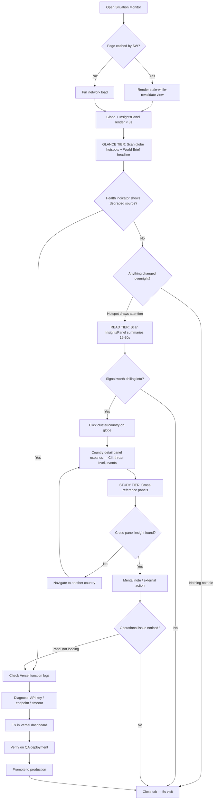
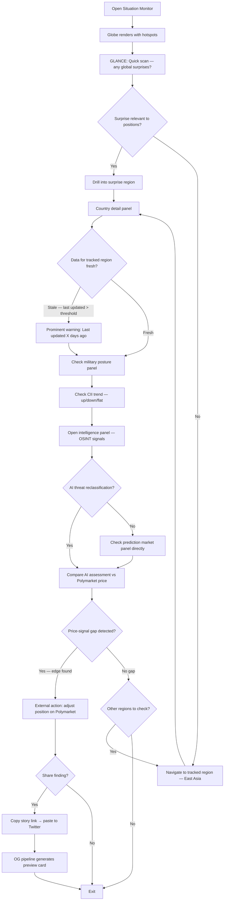
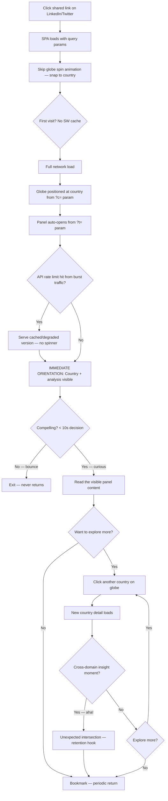
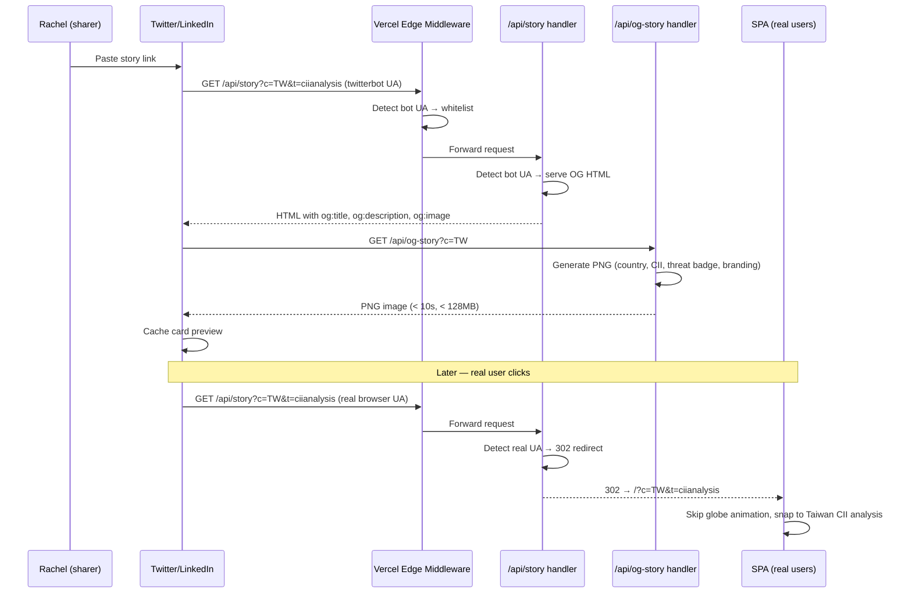
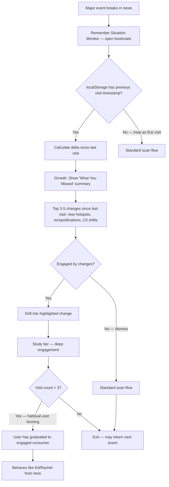

# UX Design Specification — Situation Monitor

**Author:** Ed
**Date:** 2026-02-23

---

## Executive Summary

### Project Vision

Situation Monitor takes an existing, production-grade intelligence dashboard (World Monitor v2.5.5) and tailors it for a consumer audience that wants actionable global awareness — not analyst-grade OSINT tooling. The UX challenge is not building from scratch but establishing a distinctive identity and guiding incremental improvements within the constraints of a brownfield fork. The platform is live and working; UX evolution is additive, not reconstructive.

### Target Users

**Primary:** Ed — solo operator and daily power user. Uses the platform as a morning briefing tool, synthesizing overnight developments across geopolitical, economic, and security domains in 30 minutes. Also the operator who diagnoses and fixes issues (API key rotation, endpoint failures) via the **settings page** (`settings.html`) — a separate HTML entry point with its own UX surface. Needs: fast load, AI summaries surfacing top developments, cross-panel data correlation, operational visibility.

**Secondary:** Rachel — prediction market edge-seeker. Visits 3-4x/week focused on specific regions where she has market exposure. Cross-references military posture + AI threat classification + prediction market pricing to identify informational edges. Needs: region-focused drill-down, threat-to-market correlation, selective domain engagement (uses 3-4 of 20 domains).

**Tertiary:** Marcus — casual visitor arriving via shared social link. High engagement per session but low frequency. Expects immediate orientation from deep-link parameters. Retention driver is the cross-domain "unexpected intersection" insight. **Note:** Mobile-arriving users encounter a `MobileWarningModal` ("desktop recommended" dismissable notice) as their first interaction — potentially hostile to consumer discovery via social shares. Needs: deep-link auto-navigation, self-explanatory first impression, zero signup friction.

**Non-Human:** Social preview bots (Twitter, LinkedIn, Discord). Requires correct OG meta tags, dynamic image generation, and bot-vs-human bifurcation in the middleware.

### Key Design Challenges

1. **Information density vs. signal clarity** — The `VITE_VARIANT=full` build tree-shakes tech/finance variant panels at build time, so the actual runtime panel count is fewer than the 26 listed in the component inventory. Regardless, the density is substantial — consumer users need signal extraction, not a firehose. Power users want density; casual visitors want curated highlights. The single-view architecture (no routing, no pages) means progressive disclosure must happen within the existing grid layout.

2. **Fork branding within architectural constraints** — Tier 1-2 changes only (CSS custom properties, meta tags, DOM injection). No `App.ts` modifications without Tier 3 justification. UX identity must emerge from color, typography, text content, and OG card design — not structural layout changes.

3. **Dual entry point branding** — The application has two independently loading HTML pages: `index.html` (main SPA) and `settings.html` (operator settings/API key management). Both need consistent fork branding (title, meta tags, CSS theme). A single `<style>` injection in the SPA doesn't cover the settings page — branding must be applied to both entry points.

4. **Mobile discovery gap** — Users likely discover via mobile social media, but the experience is optimized for desktop (WebGL globe, multi-panel grid). The SVG mobile fallback exists but isn't refined. The `MobileWarningModal` actively discourages mobile usage — directly hostile to the consumer discovery pattern where Marcus arrives from a social share on his phone. Deep-link landing on mobile must still orient the user despite the reduced viewport.

5. **Visual change verification** — Every UX modification requires manual QA on Vercel Preview (6 FRs with zero automated visual testing). This constrains iteration speed and requires disciplined visual review process.

6. **Modular architecture opportunity** — **[v2.5.8 UPDATE]** `App.ts` has been decomposed from a 4,629 LOC God Object into a 498 LOC shell + 8 modules in `src/app/`. Panel lifecycle is now in `panel-layout.ts` (930 LOC), event routing in `event-handlers.ts` (731 LOC). UX changes requiring panel behavior modification (visibility, ordering logic, conditional rendering) may now be achievable as Tier 2 changes by hooking into specific modules. **Specific update:** curated default panel ordering is more likely Tier 2 if `panel-layout.ts` exposes ordering hooks. Spike should confirm.

### Design Opportunities

1. **Brand identity through CSS theming** — CSS custom properties allow accent color, background tones, text styling, and dark theme refinement without touching component code. A cohesive color palette and typography treatment can make Situation Monitor feel distinctly different from World Monitor.

2. **OG card design as acquisition UX** — The social sharing pipeline (story URLs + dynamic OG image generation) is the primary organic growth channel. Investing in OG card visual quality (clear threat level badges, branded layout, readable at thumbnail size) directly impacts click-through from social platforms.

3. **Deep-link landing optimization** — When users arrive via `?c=UA&t=ciianalysis`, the SPA auto-navigates to the relevant country and panel. Ensuring this transition is smooth, fast, and visually clear (panel highlighted, map centered) is the highest-impact first-impression UX for Growth.

4. **Curated default panel hierarchy** — Rather than treating all runtime domains equally in the grid, elevate the 4-5 most consumer-relevant domains (conflict, prediction markets, AI intelligence, economic, cyber) in default panel ordering. Other domains are available but discoverable, not dominant. **Implementation note:** This is Tier 1 only if `createPanels()` reads from an overridable config; Tier 3 if the order is hardcoded in `App.ts`. Spike must confirm before committing to this approach.

5. **Cross-domain insight surfacing** — The platform's unique value is seeing correlations across domains (conflict → energy prices → market movements). UX patterns that highlight these connections — even through panel proximity, shared color coding for related events, or AI summary cross-references — create the retention-driving "aha moment" identified in user Journey 3.

6. **MobileWarningModal softening** — The current "desktop recommended" modal is appropriate for an analyst tool but counterproductive for consumer discovery. A Growth-phase UX improvement: suppress the modal for deep-link arrivals (user came for specific content, not to browse) or replace with a subtle toast/banner that doesn't interrupt the first impression.

7. **Settings page as operator UX** — `settings.html` is Ed's primary operational interface for API key management and feature toggles (`RuntimeConfigPanel`, 603 LOC). Fork branding this surface ensures a consistent identity across the full operator experience. This is a Tier 1 change (meta tags + CSS in `settings.html`).

## Core User Experience

### Defining Experience

**The ONE thing users do most frequently:** Glance at the globe and panels to answer "what's happening right now?" — then drill into a specific region or domain for depth. This is a **scan → drill → correlate** loop.

- **Scan:** Globe hotspots + AI summary panel give the 10-second "state of the world" read
- **Drill:** Click a country/cluster → panels filter to that region's data across domains
- **Correlate:** Cross-reference 2-3 panels (e.g., conflict + markets + prediction odds) to form an insight

The interaction that must be absolutely effortless is the **scan**. If the first 10 seconds don't deliver a clear "here's what matters," the consumer user bounces. Ed stays because he's committed; Rachel and Marcus stay only if the scan hooks them.

**Scan effectiveness dependency:** The scan works only if the right panels are visible in the default grid position. Specifically, `InsightsPanel` (AI world brief, 633 LOC) and `PizzIntIndicator` (DEFCON-style threat level, 162 LOC) must be near the top of the panel order. If these are buried below the fold, the "scan before drill" principle fails. This connects to Design Challenge #6 — curated default panel ordering may require a spike to confirm whether it's Tier 1 or Tier 3.

**Three drill entry points — all must deliver "one click, many answers":**

| Entry Point | User | Mechanism |
|---|---|---|
| **Globe click** | All users (visual exploration) | Click country/cluster → `Map → App → all panels respond` |
| **Deep-link URL** | Marcus (social share arrival) | `?c=UA&t=ciianalysis` → SPA auto-navigates to country + panel |
| **⌘K Search** | Ed, Rachel (power users) | `SearchModal` (378 LOC) → keyboard search → jump to country/topic |

All three entry points converge on the same App.ts event flow and must produce identical drill results. The fork must not break any of these paths.

**Core interaction to get right:** Country/region click → relevant data surfaces across all active panels simultaneously. This is the moment where 17 disconnected data sources become one coherent intelligence picture. It's the product's fundamental UX promise.

### Platform Strategy

| Platform | Role | Status | Priority | Notes |
|---|---|---|---|---|
| **Desktop browser** | Primary experience | Inherited, working | MVP | WebGL globe + multi-panel grid |
| **Mobile browser** | Discovery & quick-check | Inherited, functional | MVP (works) / Growth (refined) | SVG fallback works; UX unrefined. Marcus's MVP journey requires mobile to *function*, not be *polished*. |
| **Desktop app (Tauri)** | Out of scope | Dormant in codebase | Future/Never | — |
| **PWA (offline)** | Network continuity | Inherited, working | MVP (inherited) | Service worker cache-first assets |

**Mobile strategy clarification:** The PRD defines Marcus (mobile-arriving casual visitor) as a tertiary MVP user — his journey must work in MVP. Mobile *functions* today (inherited SVG fallback). The distinction:
- **MVP:** Mobile works — deep-links orient correctly, panels render data, no crashes. Inherited behavior, no fork work needed.
- **Growth:** Mobile is refined — `MobileWarningModal` softened/suppressed, touch interactions improved, panel grid optimized for narrow viewports.

**Interaction model:** Mouse/keyboard primary. Touch is secondary (mobile fallback). No gesture-driven interactions in the fork — inherit upstream's responsive behavior.

**Platform constraints (from architecture):**
- WebGL 2 required for desktop globe (deck.gl/MapLibre) — no Canvas fallback
- Mobile automatically gets SVG/D3 map renderer (no WebGL) via `MapContainer` facade
- Two HTML entry points: `index.html` (SPA) and `settings.html` (operator config) — both need fork branding
- PWA service worker provides cache-first assets, network-first data — offline continuity is inherited, not designed

### Effortless Interactions

**Must feel zero-effort:**

1. **Globe orientation on load** — The 3D globe should communicate "something is happening" within 2 seconds through visible hotspot clusters. No interaction required to see that the world has events worth exploring. The scan happens before the user does anything.

2. **Country drill-down (all three entry points)** — Globe click, deep-link, or ⌘K search → all panels respond with that country's data. This happens via upstream's existing event flow (`Map → App → Panels`). The fork must not break this chain. It should feel like "one click, 17 answers."

3. **Deep-link arrival** — Shared URL → land directly on the relevant country + panel. No navigation, no globe spinning, no "where am I?" moment. The `?c=UA&t=ciianalysis` pattern already does this. Fork branding must not delay or obscure this instant orientation. **Testable constraint:** Branding injection must add < 200ms to deep-link load time. The spike should measure before/after.

4. **Data freshness transparency** — Users should never wonder "is this current?" Each panel's last-update timestamp should be quiet but visible. Stale data should look stale (existing upstream pattern: `scheduleRefresh` with visibility-aware jitter).

**Should happen automatically (no user action):**

- AI summaries generate and cache in the background (Groq → OpenRouter → T5 fallback)
- Panel data refreshes on intervals (hidden-tab throttling reduces unnecessary fetches)
- Offline fallback activates transparently when network drops
- Fork branding applies before first paint (CSS `<style>` in `<head>`)

### Critical Success Moments

| Moment | User | Make-or-Break? | UX Requirement | Verification |
|---|---|---|---|---|
| **First 10 seconds** | All | **YES** | Globe loads with visible hotspots. AI summary panel shows top developments. | LCP < 4s (NFR1) + at least one hotspot cluster rendered. Lighthouse CI baseline. |
| **First country click** | All | **YES** | All panels respond to the same country. The cross-domain picture materializes. | Existing Playwright coverage (`map-harness.spec.ts` tests click → panel response). |
| **Cross-domain insight** | Rachel, Marcus | Yes | User sees a connection across domains they wouldn't have found elsewhere. | Manual QA — subjective, but panel proximity + data presence are verifiable. |
| **Deep-link landing** | Marcus | Yes | Shared link → immediate context. Panel is open, map is centered, data is visible. | E2E test: navigate to `?c=UA&t=ciianalysis` → verify panel visible + map centered. |
| **OG card in social feed** | Rachel (sharing) | Yes | Preview card is compelling at thumbnail size. Threat badge, country, branding readable. | OG validator tool (opengraph.xyz). Manual visual QA. |
| **⌘K search → drill** | Ed, Rachel | Yes | Keyboard search finds country/topic instantly, triggers full panel update. | E2E test: open search modal → type → select → verify panels respond. |
| **Operational diagnosis** | Ed | No (tolerable friction) | API key rotation, endpoint debugging via Vercel logs + settings page. | Functional check: settings page loads, keys display, save works. |
| **Morning briefing complete** | Ed | Yes | Ed closes the laptop feeling informed after 30 min. | Not testable — gut-feel success. Proxy: all 20 domain panels loaded data. |

**First-time user success:** A user who arrives for the first time (via direct URL or deep-link) understands what the product does and finds one interesting data point within 30 seconds. They don't need onboarding, tutorials, or tooltips — the globe + panels are self-explanatory because the data IS the interface.

### Experience Principles

1. **Data is the interface.** No chrome, no marketing, no onboarding wizards. The globe and panels ARE the product. Every pixel shows information, not UI scaffolding. Fork branding is a thin layer on top of this density — accent color and identity, not decoration.

2. **Scan before drill.** The default state communicates the "state of the world" without interaction. Hotspots glow, summaries are visible, threat levels have color. The user decides where to drill based on what they SEE, not what they READ in a menu. *Dependency: InsightsPanel and PizzIntIndicator must be visible in the default panel grid position for the scan to work. Panel order is a UX-critical configuration.*

3. **One click, many answers.** A country click (or deep-link, or ⌘K search) activates all relevant panels simultaneously. The UX promise is "you don't need to navigate between tools" — the tool navigates for you. Cross-domain correlation is automatic, not manual. All three drill entry points must produce identical results.

4. **Graceful degradation is invisible.** When a data source is down, the panel quietly shows "unavailable" — it doesn't crash, doesn't show an error modal, doesn't break adjacent panels. The user might not even notice one of 17 sources is offline because the other 16 are working. This resilience must be perceptible as quality, not as missing features.

5. **The shared link IS the first impression.** For Growth users (Rachel, Marcus), the product experience starts in a social media feed, not on the homepage. OG card quality, deep-link orientation, and instant context delivery are the top funnel. The homepage is for returning users; the shared link is for new ones.

6. **Operator UX prioritizes speed and clarity over visual polish.** Ed's operational mode (settings page, API key management, diagnostic flows) is a fundamentally different UX posture from consumer browsing. Operator surfaces optimize for "find the problem, fix it, move on" — functional layout, clear labels, fast feedback. The settings page doesn't need to delight; it needs to work.

---

## Desired Emotional Response

### Primary Emotional Goals

| Goal | Description | Fork Action | Target Phase |
|------|-------------|-------------|---------------|
| **Informed confidence** | The user should feel "I understand what's happening globally right now" within 5 seconds of landing. The scan phase delivers this — hotspots, summaries, colour-coded threat levels create a gestalt of awareness before any interaction. | **Preserve** — inherited from upstream's InsightsPanel, PizzIntIndicator, and globe heatmap. Fork work is verification + branding, not implementation. | MVP |
| **Discovery satisfaction** | Drilling into a country should feel like opening a dossier, not navigating a dashboard. Cross-domain panels lighting up simultaneously creates a "the tool knows what I want" moment. | **Preserve** — upstream's country-click → multi-panel activation is the core mechanic. Fork ensures deep-links and ⌘K search produce identical results. | MVP |
| **Shareability pride** | When Rachel shares a link on X, the OG card should make her feel "this makes me look smart." The card is the product's first impression — it must be polished, informative, and distinctive. | **Create** — OG card generation (`/api/og-story`) is fork-implemented. Card design, branding, and metadata are net-new work. | MVP |
| **Operational control** | Ed managing API keys or checking data source health should feel like a cockpit — functional, fast, zero ambiguity. No delight required; just clarity and speed. | **Create** — settings page operator UX, API key management UI, and diagnostic flows are fork-specific. | MVP |

### Emotional Journey Mapping

| Stage | User State | Desired Emotion | Design Lever | Fork Action |
|-------|-----------|-----------------|--------------|-------------|
| 1. First landing (direct) | Curious, possibly skeptical | "This looks serious and useful" | Globe animation, panel density, professional colour palette, fork branding (< 200ms) | **Preserve** globe + panels; **Create** branding injection |
| 2. First landing (deep-link) | Context-seeking, impatient | "I can see immediately what was shared" | Pre-oriented globe, highlighted country, visible summary panel | **Preserve** deep-link orientation; **Create** OG card → landing coherence |
| 3. Scan phase | Absorbing, assessing | "I can tell where the action is" | InsightsPanel position, PizzIntIndicator visibility, colour intensity mapping | **Preserve** — upstream panel grid and indicator logic |
| 4. Drill phase | Investigating, focused | "Everything I need appeared at once" | Multi-panel activation, cross-domain data correlation, ⌘K search equivalence | **Preserve** country-click mechanics; **Verify** ⌘K parity |
| 5. Correlate phase | Connecting, pattern-matching | "I'm seeing connections others miss" | Adjacent panel data, temporal overlays, investment-to-news correlation | **Preserve** — upstream correlation emerges from panel adjacency |
| 6. Share phase | Confident, proud | "This insight is worth sharing" | OG card quality, deep-link reliability, instant context for recipients | **Create** — OG card design, share UX, link metadata |
| 7. Return visit | Habitual, efficient | "I can check in quickly" | Panel memory, loading speed, consistent layout, branding familiarity | **Preserve** layout persistence; **Create** fork branding recognition |
| 8. Post-upstream-sync | Cautious, verifying | "Everything still works — my changes are safe" | Visual diff (fork branding intact, panel order preserved, OG cards still generate), automated smoke tests | **Create** — this emotional stage is unique to fork maintenance. No upstream equivalent. |

### Micro-Emotions

1. **Loading → Loaded:** The transition from skeleton/spinner to populated panels should feel instant. Target: < 1s perceived load for above-fold content. A slow load undermines "informed confidence." *(Preserve — upstream loading performance; fork adds branding injection which must not regress perceived speed.)*
2. **Hover → Reveal:** Country hover on the globe should preview information before click. The micro-emotion is anticipation — "there's more here if I want it." *(Preserve — upstream hover mechanics are inherited.)*
3. **Click → Cascade:** The moment between country click and multi-panel update should feel like a cascade, not a sequence. Panels updating staggered (data-ready order) is acceptable; panels updating with visible loading states for > 500ms is not. *(Preserve — upstream panel update orchestration.)*
4. **Share → Validation:** After copying a share link, the user should feel "this will look good when someone opens it." The share action should include visual confirmation (toast + OG card preview). *(Create — share UX and OG card preview are fork features.)*

### Design Implications

| Implication | Affected Components | Priority | Fork Action |
|-------------|-------------------|----------|-------------|
| Globe must render with professional-quality animation on first load | Globe, MapPanel | P0 — first impression | **Preserve** — upstream Three.js globe |
| InsightsPanel must be above-fold in default panel layout | InsightsPanel, PanelGrid | P0 — scan phase enabler | **Verify** — panel order may need Tier 1 or Tier 3 change |
| OG cards must match the quality bar of the live dashboard | OG card templates, `/api/og-story` | P0 — share phase enabler | **Create** — fork-specific implementation |
| Fork branding injection must complete in < 200ms | `<style id="fork-theme">`, CSS custom properties | P0 — first impression timing | **Create** — fork branding system |
| Country click → panel update must feel instantaneous (< 300ms visible) | AISummaryPanel, NewsPanel, InvestmentPanel, all drill panels | P1 — drill satisfaction | **Preserve** — upstream event bus and panel update logic |
| Loading skeletons must match fork colour palette | All panels with loading states | P1 — brand coherence during load | **Create** — CSS custom properties must cascade to skeleton states |
| Share toast + OG preview must appear within 200ms of share action | ShareButton, Toast system | P1 — share validation emotion | **Create** — net-new fork UX |
| Post-upstream-sync visual verification must be achievable in < 2 minutes | Fork branding, OG cards, panel order, key user flows | P2 — operator confidence | **Create** — verification checklist or automated smoke test |

### Emotional Design Principles

1. **Competence over friendliness.** `[MVP]` The product should feel like a Bloomberg terminal designed for non-analysts, not like a social media dashboard. Rounded corners and playful animations undermine the "informed confidence" goal. Sharp edges, data density, and professional typography signal competence. *(Create — this is the fork's brand voice, distinct from upstream's neutral styling.)*

2. **Silence signals health.** `[MVP]` The absence of error messages, loading failures, and broken panels IS the emotional experience of reliability. The product earns trust by not breaking, not by displaying "all systems operational" banners. *(Preserve — upstream's error handling and graceful degradation. Fork must not regress this.)*

3. **Speed is an emotion.** `[MVP]` Sub-second transitions are not a performance metric — they are an emotional design choice. The feeling of "this tool is fast" creates trust, competence perception, and return-visit habit. Every fork addition (branding injection, OG card generation, share UX) must meet upstream's speed bar. *(Create — fork additions must match upstream's perceived performance. Branding injection < 200ms is the binding constraint.)*

4. **The share is the product.** `[Growth]` For Growth-phase users, the OG card IS Situation Monitor. The dashboard is what they discover after the card intrigues them. Card design quality must match or exceed dashboard quality — it's not a thumbnail, it's a storefront. *(Create — entirely fork-specific. No upstream OG card system exists at this quality level.)*

5. **Verify, don't assume, after every sync.** `[MVP → ongoing]` Post-upstream-merge emotional safety requires visible verification. The fork operator (Ed) must be able to confirm — quickly and confidently — that branding, OG cards, panel order, and key flows survived the merge. This is not a testing principle; it's an emotional design principle for the operator persona. *(Create — unique to fork lifecycle. Build verification UX that makes Ed feel "everything is still mine.")*

---

## UX Pattern Analysis & Inspiration

### Inspiring Products Analysis

#### Twitter/X — The Incumbent Workflow

Twitter is the product Situation Monitor is replacing, which makes it the primary source of both inspiration and anti-patterns. What Twitter does well:

| Strength | UX Mechanism | Relevance to Situation Monitor |
|----------|-------------|-------------------------------|
| **Serendipitous discovery** | Algorithmic feed surfaces unexpected connections | The globe scan phase must replicate this — hotspots should surface things you didn't know to look for |
| **Opinion diversity** | Many perspectives on the same event, visible simultaneously | The single most important insight: the value isn't "Event X happened" — it's "here are 17 takes on Event X." Growth-phase feature territory. |
| **Zero-effort monitoring** | Scroll = awareness. No queries, no filters, no configuration | The scan phase must match this: land on Situation Monitor, absorb the state of the world, no clicks required |
| **Real-time feeling** | Even stale content feels current because of the feed format | Panel data freshness indicators must create the same "this is happening now" perception |

#### What Twitter Does Poorly (Why You're Building This)

| Weakness | UX Failure | Situation Monitor Advantage |
|----------|-----------|----------------------------|
| **No structure** | Events, jokes, ads, and opinions are interleaved | Panel-based layout separates domains. News is news. Investments are investments. The structure IS the UX. |
| **No geographic context** | Events are text-only — no spatial awareness | The globe is the primary interface. Geography is the organizing principle, not chronology. |
| **No cross-domain correlation** | A coup in Niger and a uranium price spike are separate tweets | Country drill shows news + investments + energy + military simultaneously. Correlation is automatic. |
| **No persistence** | Scroll past it, it's gone | Deep-links, OG cards, and panel state mean events are addressable and shareable with context preserved. |
| **Infinite scroll fatigue** | No "done" state — you never feel caught up | The scan phase has a natural completion: you've seen the globe, you've read the insights panel, you know the state of the world. Done. |

#### Twitter Replacement Checklist — Honest MVP Assessment

If Twitter is the incumbent, Situation Monitor must explicitly beat it on its weaknesses while acknowledging where MVP falls short:

| Dimension | Twitter | Situation Monitor MVP | Winner | Growth Target |
|-----------|---------|----------------------|--------|---------------|
| Time-to-awareness | Infinite scroll, no "done" state | < 5 seconds scan phase, natural completion | **SM** | Maintain |
| Geographic context | None — text only | Globe-as-interface, colour-coded hotspots | **SM** | Enhance with more data layers |
| Cross-domain correlation | Manual — user connects the dots | Automatic — single click, all panels | **SM** | Add more correlation panels |
| Serendipity | Algorithmic — surfaces the unexpected | Hotspot-based — surfaces geographic activity | **Draw** | Hotspots must match Twitter's surprise factor |
| Opinion diversity | Massive — millions of voices | **None in MVP** — fact-layer only | **Twitter** | Sentiment panels, social pulse indicators |
| Shareability | Native — tweet/retweet/quote | OG cards + deep-links — different but equivalent | **Draw** | Richer OG cards, share UX refinement |
| Persistence | Poor — scroll past, it's gone | Strong — deep-links preserve context | **SM** | Maintain |

**Honest gap:** MVP Situation Monitor cannot match Twitter's opinion diversity. This is the Growth-phase strategic priority, not an MVP failure.

#### Adjacent Products — Lessons Without Direct Inspiration

Since no product does what Situation Monitor does, we extract patterns from adjacent categories:

| Product Category | Example | Relevant Pattern | Anti-Pattern |
|-----------------|---------|-----------------|---------------|
| **Financial terminals** | Bloomberg, Refinitiv | Panel density = professional credibility. Many panels visible simultaneously signals "this is a serious tool." | Overwhelming configuration. Bloomberg requires training. Situation Monitor must be zero-config for consumers. |
| **Flight trackers** | Flightradar24 | Globe-as-interface works. People understand "click on the map to learn more." Proven interaction model. | Data overload on the map itself. Too many icons/labels create noise. Situation Monitor's globe should be cleaner. |
| **News aggregators** | Google News, Feedly | Category-based organization (world, tech, business) parallels panel domains. | Algorithm-driven filtering hides important events. Situation Monitor shows everything; the user decides what to drill. |
| **OSINT dashboards** | Dataminr, Janes | Real-time alerting and event classification. Professional users expect data density. | Analyst-only UX. Login walls, complex filters, specialized vocabulary. Situation Monitor is for Rachel scrolling Twitter, not an analyst at a desk. |

### Competitive Gap Map

| Capability | Twitter/X | Bloomberg | Flightradar24 | Google News | Dataminr | Situation Monitor |
|-----------|-----------|-----------|---------------|-------------|----------|-------------------|
| Geographic organizing principle | ❌ | ❌ | ✅ | ❌ | ✅ | ✅ |
| Multi-domain correlation (single click) | ❌ | ❌ | ❌ | ❌ | Partial | ✅ |
| Zero-config value delivery | ✅ | ❌ | ✅ | ✅ | ❌ | ✅ |
| Shareable deep-links with context | Partial | ❌ | ❌ | Partial | ❌ | ✅ |
| Open access (no login wall) | Partial | ❌ | ✅ | ✅ | ❌ | ✅ |
| Opinion/sentiment layer | ✅ | ❌ | ❌ | ❌ | Partial | Growth |

**Unique position:** Situation Monitor is the only product that combines geographic organizing principle + multi-domain correlation + zero-config + open access + shareable deep-links. The opinion/sentiment gap is the Growth-phase strategic priority.

### Transferable UX Patterns

| Pattern | Source | Relevance | Fork Work | Architectural Feasibility |
|---------|--------|-----------|-----------|---------------------------|
| **Globe-as-nav** — the map IS the menu | Flight trackers | Primary navigation for drill phase | **Zero** — upstream Three.js globe already implements this | Free — verify only |
| **Panel-as-category** — each panel is a self-contained domain view | Financial terminals | Enables cross-domain correlation at a glance | **Zero** — upstream's 26-panel grid is the implementation | Free — verify panel order |
| **Scan-then-drill** — default state communicates enough to decide where to focus | Twitter feed model | Core interaction loop — scan phase must work without clicks | **Zero** — upstream InsightsPanel + PizzIntIndicator + globe heatmap | Free — verify positioning |
| **Single-click cascade** — country click activates all panels | Unique to SM | The killer interaction — no adjacent product does this | **Zero** — upstream event bus handles this | Free — verify ⌘K parity |
| **Deep-link as entry point** — shared link drops into specific context | Social platforms | Share phase enabler — the product starts in someone else's feed | **Partial** — upstream has deep-link support; fork creates OG card coherence | **Net-new fork work** — OG card design + landing coherence |
| **Zero-configuration awareness** — land, absorb, leave | Twitter | Matches "informed confidence" emotional goal | **Zero** — upstream delivers this already | Free — verify only |

**Key insight:** 5 of 6 transferable patterns are already implemented upstream. The inspiration strategy is primarily about **verifying we haven't broken** these patterns, not building them. The one pattern requiring real fork work is deep-link-to-OG-card coherence.

### Anti-Patterns to Avoid

1. **Infinite scroll without completion** — Twitter's core failure. Situation Monitor must have a natural "I'm caught up" state. The scan phase provides this: you've seen the globe, read the insights, you're done.
2. **Algorithmic filtering that hides events** — Google News decides what you see. Situation Monitor shows everything; the globe and panel layout are the filter, not an algorithm.
3. **Configuration-heavy first experience** — Bloomberg requires training; Dataminr requires setup. Situation Monitor must deliver value on first landing with zero configuration.
4. **Login walls before value** — Many OSINT tools gate content behind authentication. Situation Monitor is open by default. The product sells itself by being usable immediately.
5. **Opinion suppression** — News aggregators strip opinion to present "objective" summaries. The opinion layer is the Growth-phase strategic differentiator — don't design it out at the architecture level.
6. **Mobile-first responsive that ruins desktop density** — Responsive frameworks that collapse panels to single-column on desktop destroy the "many panels at once" value proposition. Desktop is primary; mobile is functional, not equivalent.

### Design Inspiration Strategy

**What to Adopt:**
- **Globe-as-interface** from flight trackers — proven, intuitive, matches our geographic organizing principle. *Already implemented upstream.*
- **Panel density** from financial terminals — signals credibility, enables cross-domain correlation. *Already implemented upstream.*
- **Zero-config value delivery** from Twitter — land and absorb, no setup required. *Already implemented upstream.*
- **Deep-link as first impression** from social platforms — the share is the product. *Partially upstream; OG card coherence is fork work.*

**What to Adapt:**
- **Twitter's serendipitous discovery** → translate from algorithmic feed to geographic hotspots. The globe replaces the algorithm — colour intensity and InsightsPanel replicate the "oh, something's happening there" moment.
- **Bloomberg's data density** → keep the density, remove the complexity. Panels are read-only views, not configurable workspaces. Density without configuration.
- **Flightradar24's map interaction** → adopt click-to-reveal, but our cascade (multi-panel activation) goes far beyond their single-entity detail view.

**What to Avoid:**
- **Infinite scroll** — conflicts with "informed confidence" emotional goal
- **Algorithmic curation** — conflicts with "show everything" transparency principle
- **Configuration overhead** — conflicts with zero-effort interaction model
- **Mobile-first design** — conflicts with desktop-primary panel density strategy

### The Opinion Layer — Growth-Phase Strategic Signal

> *"Opinions about events might be more valuable than the events themselves."* — Ed

This is the **product thesis for Growth phase.** It answers the question: "Why would someone use Situation Monitor instead of just checking Twitter?"

- **MVP answers:** "Because it's structured, geographic, and cross-domain. You get the state of the world in 5 seconds."
- **Growth answers:** "Because it shows you what people *think* about what's happening, not just what's happening."

**Growth-phase feature implications:**

| Feature | Description | Panel Architecture Impact |
|---------|-------------|---------------------------|
| **Sentiment analysis panels** | Per-country social sentiment alongside news panels | New panel type — fact-layer + opinion-layer side by side |
| **Social pulse indicators** | Visual indicator of social media activity intensity per country | Could be a globe overlay or panel widget — design system must support both |
| **"Hot take" density as signal** | High opinion volume about a country IS a type of threat/activity indicator | Maps to PizzIntIndicator-style visual — could augment existing indicator |
| **Perspective diversity index** | How polarized are opinions about a country? Consensus vs. controversy. | New data dimension — requires panel or indicator design |

**Design system constraint:** The design system must ensure the layout supports opinion-layer panels alongside fact-layer panels. The panel architecture already accommodates this — it's a data source question, not a UX architecture question. But the visual design must not preclude mixed fact/opinion panel grids.

---

## Design System Foundation

### Design System Choice

**Fork Theming Layer** — `--sm-*` CSS custom properties overlay on upstream's existing component system.

Situation Monitor does not adopt, replace, or build a design system. It **inherits** World Monitor's de facto design system (component structure, layout patterns, panel architecture) and applies a **theming layer** via CSS custom properties injected through `<style id="fork-theme">`. This preserves upstream mergeability while establishing fork visual identity.

### Rationale for Selection

| Factor | Decision Driver |
|--------|----------------|
| **Upstream mergeability** | Any component-level replacement (MUI, Chakra, etc.) would make upstream merges catastrophic. CSS-level theming is the only approach that doesn't create structural merge conflicts. |
| **Solo developer** | Ed cannot maintain a custom design system AND track upstream changes. The theming layer is the minimum viable fork surface. |
| **52 existing components** | Replacing them gains nothing — they work. Theming them gains brand identity at near-zero cost. |
| **"Competence over friendliness" principle** | The upstream visual language already signals competence (data density, dark theme, professional typography). We're refining the palette and branding, not redesigning the aesthetic. |
| **Panel architecture** | Upstream's panel system is the UX. Replacing it with a design system's component library would break the core interaction loop. |

### Implementation Approach

**Tier 1 — `--sm-*` CSS Custom Properties (zero merge risk):**
- All fork CSS custom properties use the `--sm-` prefix (Situation Monitor) — never `--fork-` or any generic prefix
- Define fork colour palette, typography, and chrome as `--sm-*` tokens in `src/fork/theme.css`
- Inject via `<style id="fork-theme">` at runtime through `src/fork/theme-inject.ts`
- **Cascade rule:** `<style id="fork-theme">` must be the **last stylesheet loaded** in `<head>` to ensure CSS specificity without `!important`. If upstream adds styles after the injection point, fork overrides fail silently — this is a tracked merge hazard.
- Branding injection must complete in < 200ms (per emotional design principle)

**Tier 2 — Fork Component Wrappers (low merge risk):**
- `src/fork/` directory for fork-specific component wrappers
- Wrapper components delegate to upstream components with fork-specific props/styling
- Example: `ForkHeader` wraps upstream header with Situation Monitor branding
- Never modify upstream component files directly

**Tier 3 — Upstream Modifications (tracked merge risk):**
- When CSS-only or wrapper approaches are insufficient
- Each modification tracked in `src/fork/UPSTREAM_CHANGES.md`
- Minimized to essential changes (e.g., panel order if not configurable via CSS/config)

### Fork Theming File Structure

```
src/fork/
  theme.css              ← all --sm-* custom property definitions (single source of truth)
  theme-inject.ts        ← runtime injection (<style id="fork-theme">, < 200ms)
  UPSTREAM_CHANGES.md    ← Tier 3 modification tracker
```

- `theme.css` is the single source of truth for all `--sm-*` tokens. No token definitions scattered across components or inline in HTML.
- `theme-inject.ts` loads `theme.css` content and injects it as `<style id="fork-theme">` at runtime. Injection timing is controlled in TypeScript.
- Single import in `main.ts`: `import './fork/theme-inject'` — additive, zero merge conflict with upstream's `main.ts`.

### Customization Strategy

**What the fork themes (`--sm-*` custom properties):**

| Token Category | Example | Purpose |
|---------------|---------|--------|
| **Colour palette** | `--sm-primary`, `--sm-accent`, `--sm-bg` | Brand identity distinct from World Monitor |
| **Typography** | `--sm-font-family`, `--sm-heading-weight` | Professional tone refinement |
| **Panel chrome** | `--sm-panel-border`, `--sm-panel-header-bg` | Panel visual identity |
| **Globe overlay** | `--sm-hotspot-colour`, `--sm-heatmap-palette` | Geographic visualization branding |
| **OG card palette** | `--sm-og-bg`, `--sm-og-accent` | Share phase visual identity |
| **Loading states** | `--sm-skeleton-bg`, `--sm-spinner-colour` | Brand coherence during load (per Step 4 micro-emotions) |
| **Opinion layer (Growth)** | `--sm-panel-opinion-border`, `--sm-panel-fact-border` | Semantic variants for mixed fact/opinion panels |

**What the fork does NOT theme:**
- Panel layout/grid logic (upstream)
- Component interaction behaviour (upstream)
- Data fetching/caching patterns (upstream)
- Globe rendering engine (upstream Three.js)

### Theme Verification Checklist

Post-upstream-merge verification — implements the Step 4 emotional design principle: *"Verify, don't assume, after every sync."*

| Verification | Method | Automated? |
|-------------|--------|------------|
| `--sm-*` properties still override upstream defaults | Visual regression snapshot of 3 key views (globe, country drill, OG card) | Yes — Playwright screenshot comparison |
| `<style id="fork-theme">` is last in cascade | DOM assertion: `document.querySelector('style#fork-theme')` is last `<style>` child of `<head>` | Yes — E2E test |
| Branding injection < 200ms | Performance mark in `theme-inject.ts`, asserted in E2E | Yes — Playwright performance API |
| No `!important` in fork CSS | Lint rule: grep `theme.css` for `!important`, fail CI if found | Yes — CI lint step |
| Upstream hasn't added conflicting `--sm-*` properties | Grep upstream diff for `--sm-`, flag if found | Yes — merge script check |

---

## Defining Core Experience

### Promise Statement

| Variant | Text | Usage |
|---------|------|-------|
| **Promise (external)** | "The state of the world, the moment you arrive." | Marketing, README, OG cards, social media |
| **Action (UX spec)** | "Open the page, know the state of the world." | UX specification, developer guidance |
| **Technical (architecture)** | "Zero-click global situational awareness in < 5 seconds." | Architecture docs, performance requirements |
| **Pitch (one-liner)** | "Like checking the weather, but for the world." | Casual explanation, elevator pitch |

### Defining Experience

**"Open the page, know the state of the world."**

Situation Monitor's defining experience is the **scan phase** — the moment between landing and the first click. In under 5 seconds, the user absorbs the global situation through the globe's visual intensity, the InsightsPanel summary, and panel density. No interaction required. The product delivers value before the user does anything.

This is the interaction users describe to friends: *"I just open it and I can see what's going on."* Or more casually: *"It's like checking the weather, but for the world."*

The drill phase (country click, ⌘K search, deep-link) is a **secondary capability** — powerful, but not the product promise. Users may never click a country and still get full value from the scan. The scan is the product; the drill is the power-user layer.

| Experience Layer | Description | Value Delivery | Fork Work |
|-----------------|-------------|---------------|------------|
| **Scan (defining)** | Land → absorb globe + panels → know the state of the world | Passive — zero interaction required | **Preserve** — upstream delivers this. Fork verifies + brands. |
| **Drill (secondary)** | Click country / ⌘K / deep-link → multi-panel cascade | Active — user-initiated investigation | **Preserve** — upstream delivers this. Fork verifies ⌘K parity. |
| **Correlate (emergent)** | Adjacent panels reveal cross-domain patterns | Passive — emerges from panel layout | **Preserve** — upstream panel adjacency. Fork verifies panel order. |
| **Share (growth)** | OG card + deep-link capture a moment | Active — user-initiated distribution | **Create** — fork-specific OG card system. |

### Scan Depth Tiers

Not all scans are equal. Different users scan at different depths, and all are valid "scan-first" sessions:

| Scan Tier | User | Duration | What They Absorb | Completion Signal |
|-----------|------|----------|-----------------|--------------------|
| **Glance** (5s) | Rachel arriving via social | Globe colour gestalt + InsightsPanel headline | "I see where the action is" — may leave or drill |
| **Read** (15-30s) | Ed's daily check | Globe hotspots + InsightsPanel detail + panel header summaries | "I know what's happening today" — feels caught up |
| **Study** (1-2min) | Ed investigating something specific | All of the above + scanning individual panel content without drilling | "I understand the current state across domains" — rare but important |

The primary user (Ed) lives in the **Read** tier. The Glance tier serves social-arriving users. The Study tier is an occasional deep scan that may trigger a drill. All three must work without requiring clicks.

### User Mental Model

**Current mental model (Twitter):** "I scroll to absorb. Things catch my eye. I stop when something interesting appears. I never feel 'done.'"

**Target mental model (Situation Monitor):** "I open it and see the world. Hotspots tell me where the action is. I can drill if I want, but I usually just scan and close. I feel caught up."

The critical shift: from **infinite scroll without completion** to **finite scan with natural endpoint.** The globe is bounded — you can see the whole world. The InsightsPanel is finite — it summarizes, it doesn't stream. The user can reach a state of "I've absorbed this" that Twitter structurally prevents.

**Mental model implications:**

| Twitter Pattern | Situation Monitor Replacement | UX Consequence |
|----------------|------------------------------|----------------|
| Scroll to discover | Scan to absorb | Globe + InsightsPanel must be above-fold, immediately visible |
| Algorithm decides what you see | Geography decides what you see | Hotspot intensity = editorial judgment. What's "hot" on the globe IS the front page. |
| No completion state | Natural completion after scan | The scan phase must feel finite — "I've seen the world, I'm caught up" |
| Opinion interleaved with fact | Facts first, opinions later (Growth) | MVP is a fact dashboard. Growth adds the opinion layer Twitter excels at. |
| Chronological/algorithmic order | Geographic/severity order | Panel order and globe intensity are the editorial voice |

### Success Criteria

| Criterion | Metric | Tier | Rationale |
|-----------|--------|------|----------|
| **Time to first awareness** | < 5 seconds from landing | Glance | The scan must be faster than a Twitter scroll session |
| **Time to "caught up"** | < 30 seconds from landing | Read | Ed's daily check must feel complete within half a minute |
| **Time to cross-domain understanding** | < 2 minutes from landing | Study | Deep scan without drilling must deliver domain-spanning context |
| **Zero-click value** | User gets full scan value without any interaction | All tiers | If you have to click to understand the world, the scan failed |
| **Natural completion** | User feels "caught up" within their tier's duration | Read, Study | The bounded globe + finite InsightsPanel create natural endpoints |
| **Hotspot salience** | User's eye is drawn to the most significant region within 2 seconds | Glance, Read | The globe's visual hierarchy IS the editorial judgment |
| **Return habit** | User checks Situation Monitor like checking the weather | Read | Short, complete sessions — not long, scrolling sessions |
| **Drill optional** | Scan satisfaction ≥ 80% of sessions (no drill needed) | Read | If most sessions require drilling, the scan isn't working |

### Scan Failure Modes

| Failure Mode | Symptom | Cause | Mitigation |
|-------------|---------|-------|------------|
| **Uniform globe** | No hotspots visible — globe looks "dead" | Data sources down, or no significant events | Ensure baseline visual activity even during calm periods. A completely uniform globe reads as "broken," not "peaceful." |
| **Overwhelming globe** | Everything is hot — no visual hierarchy | Too many data sources weighted equally | Severity weighting must create visual contrast. If everything glows, nothing communicates. |
| **InsightsPanel below fold** | User doesn't see the text summary | Panel order configuration or viewport size | InsightsPanel must be position-locked above fold on desktop. This is the scan's text complement to the globe's visual. |
| **Stale scan** | Data looks current but isn't | Cache serving old data without freshness indicators | Freshness timestamps must be visible and honest. "Last updated 3h ago" is better than silent staleness. |
| **Slow render** | Globe or panels aren't populated within 5 seconds | Network latency, heavy JS bundle, slow API | Skeleton states must appear < 500ms; populated content < 1s for above-fold. The Glance tier doesn't wait. |

The **uniform globe** failure is the most insidious — it looks like a quality problem, not a data problem. A design decision is needed about what a "quiet world" looks like to distinguish "nothing significant" from "data is missing."

### Novel UX Patterns

**Pattern classification:** Established patterns combined in a novel way.

- **Globe-as-front-page** — Established (Flightradar24, Google Earth). But using it as the *editorial voice* — hotspot intensity replacing editorial curation — is novel.
- **Panel density as passive information** — Established (Bloomberg). But targeting *consumers* who don't configure panels is novel.
- **Finite scan with completion state** — Novel. No news/information product delivers a "you're caught up" feeling. This is Situation Monitor's most distinctive UX innovation.
- **Scan depth tiers** — Novel framing. The same interface serves a 5-second glance and a 2-minute study with no mode switching. Depth is user-driven, not interface-driven.

**No user education needed.** Every component is familiar (globe, panels, colours). The innovation is in the *combination* and *philosophy* (scan > drill), not in any individual interaction.

### Experience Mechanics

**1. Initiation:**
- User opens URL (direct) or clicks shared link (deep-link)
- No authentication, no onboarding, no splash screen
- Globe + panels render simultaneously

**2. Scan Interaction (zero-click):**
- Globe displays with colour-coded intensity — hotspots glow, calm regions fade
- InsightsPanel (above-fold) shows top 3-5 global developments as text summaries
- PizzIntIndicator provides at-a-glance threat/activity level
- Panel headers show domain summaries (news count, investment activity, energy status)
- User's eyes move: globe → InsightsPanel → panel headers → done

**3. Feedback (passive):**
- Visual intensity IS the feedback — brighter = more significant
- InsightsPanel text confirms what the globe suggests
- Data freshness indicators confirm "this is current"
- The absence of error states IS the quality signal

**4. Completion (natural):**
- The globe is bounded — the user has "seen the world"
- InsightsPanel is finite — the summary ends
- The user feels: "I know what's happening. I can close this."
- Average scan session: 15-30 seconds (Read tier)
- No "see more" prompts, no infinite scroll, no notification badges pulling them deeper

**5. Optional Drill (secondary):**
- If something catches their eye: click country → multi-panel cascade
- Or ⌘K → search → same cascade
- Or arrive via deep-link → pre-oriented to specific country
- Drill is powerful but not required for the defining experience

---

## Visual Design Foundation

### Colour System

**Strategy: Selective Override, Not Full Replacement.**

Upstream's colour system is well-structured (~60 CSS custom properties across backgrounds, text, borders, semantic, threat, DEFCON, and status categories). The fork theming layer (`--sm-*`) overrides a targeted subset to establish brand identity while inheriting the bulk of the system.

**Upstream palette analysis:**

| Category | Key Tokens | Values | Fork Treatment |
|----------|-----------|--------|----------------|
| Backgrounds | `--bg`, `--bg-secondary`, `--surface` | `#0a0a0a`, `#111`, `#141414` | **Override** — shift to cooler tone to distinguish SM |
| Text | `--text`, `--text-secondary`, `--accent` | `#e8e8e8`, `#ccc`, `#fff` | **Override accent only** — teal brand accent replaces white |
| Borders | `--border`, `--panel-border` | `#2a2a2a` | **Override** — subtle brand tint in borders signals "this isn't World Monitor" |
| Semantic | `--semantic-critical` through `--semantic-low` | Red/orange/yellow/green/blue | **Inherit** — severity colours are functional, not brand. Don't change. |
| Threat/DEFCON | `--threat-*`, `--defcon-*` | Standard alerting palette | **Inherit** — these are data colours, not brand colours |
| Status | `--status-live`, `--status-cached`, `--status-unavailable` | Green/yellow/red | **Inherit** — functional |
| Map | `--map-bg`, `--map-grid`, `--map-country`, `--map-stroke` | Green-tinted darks | **Override** — map tint is the most visible brand differentiation |

**Fork colour strategy — "Teal Shift":**

The upstream map tokens already lean green-teal. The fork amplifies this into a coherent brand.

### Token Mapping Table

The two-layer mechanism: `--sm-*` tokens define fork values; `theme-inject.ts` reassigns upstream's original token names so all existing `var()` references automatically pick up the fork colours.

| `--sm-*` Fork Token | Overrides Upstream | Upstream Default | Fork Value | Notes |
|---------------------|-------------------|-----------------|------------|-------|
| `--sm-bg` | `--bg` | `#0a0a0a` | `#080c10` | Cooler/bluer base |
| `--sm-bg-secondary` | `--bg-secondary` | `#111` | `#0e1216` | Cooler secondary |
| `--sm-surface` | `--surface` | `#141414` | `#121820` | Blue undertone panels |
| `--sm-border` | `--border` | `#2a2a2a` | `#1a2a35` | Teal-tinted — primary visual differentiator |
| `--sm-panel-border` | `--panel-border` | `#2a2a2a` | `#1a2a35` | Consistent border system |
| `--sm-accent` | `--accent` | `#fff` | `#4dd0e1` | Teal brand accent — use sparingly (see restraint rule) |
| `--sm-accent-dim` | *(new)* | — | `#1a3a42` | Subtle accent for hover/active backgrounds |
| `--sm-accent-text` | *(new)* | — | `#80deea` | Lighter teal for text accents |
| `--sm-accent-light` | *(new — light mode defensive)* | — | `#00838f` | Darker teal for light backgrounds (WCAG compliant) |
| `--sm-map-bg` | `--map-bg` | `#020a08` | `#020810` | Cooler map background |
| `--sm-map-grid` | `--map-grid` | `#0a2a20` | `#0a2030` | Blue-tinted grid |
| `--sm-map-stroke` | `--map-stroke` | `#0f5040` | `#0f4050` | Teal map strokes |

**Injection mechanism in `theme-inject.ts`:**

```css
/* theme.css — defines --sm-* tokens */
:root {
  --sm-bg: #080c10;
  --sm-accent: #4dd0e1;
  /* ... all --sm-* definitions ... */
}

/* Runtime override — reassigns upstream token names */
:root {
  --bg: var(--sm-bg);
  --accent: var(--sm-accent);
  /* ... each upstream token reassigned ... */
}
```

This ensures upstream components that reference `var(--bg)`, `var(--accent)`, etc. automatically receive fork values without modifying any upstream CSS files.

### Accent Restraint Rule

`--sm-accent: #4dd0e1` is a strong colour. Overuse dilutes brand; underuse wastes it. The principle: **teal is identity, not information.**

| Usage | Allowed | Rationale |
|-------|---------|----------|
| Site header / branding mark | ✅ | Primary brand moment — first thing users see |
| Active/selected state indicators | ✅ | Functional + brand reinforcement |
| Hotspot emphasis on globe | ✅ | Draws eye to scan phase focal points |
| Share button / primary CTA | ✅ (sparingly) | Single high-value action |
| Panel headers | ❌ | 26 panels × teal headers = noise, not brand |
| Body text links | ❌ | Monochrome text hierarchy is the upstream style |
| Data values in panels | ❌ | Semantic/threat colours must not compete with brand accent |
| Loading skeletons | ❌ | Skeletons should be neutral — brand appears when data arrives |

**Rule of thumb:** If you removed all teal from the page, only the brand identity should disappear — not any data comprehension. Teal is identity, not information.

### Light Mode Fork Policy

**MVP scope:** Inherit upstream's light mode as-is. Full light mode theming is Growth-phase.

**Defensive override (MVP required):**

| Scenario | What Happens | Risk | Mitigation |
|----------|-------------|------|------------|
| Dark mode (default) | Fork overrides apply correctly | None | — |
| Light mode toggle | `[data-theme="light"]` selectors are more specific than `:root` — upstream light values win for backgrounds/text | **Low** | Upstream light mode works correctly |
| Light mode + fork accent | `#4dd0e1` teal on `#f8f9fa` white = **2.4:1 contrast — fails WCAG** | **Medium** | Defensive override required |

**Required in `theme.css`:**

```css
[data-theme="light"] {
  --accent: var(--sm-accent-light, #00838f);
}
```

`#00838f` on `#f8f9fa` = **4.6:1 contrast** — passes WCAG AA. This single line prevents a broken accent colour in light mode without committing to full light theme work.

### Typography System

**Strategy: Inherit upstream's monospace stack entirely.**

Upstream uses `SF Mono → Monaco → Cascadia Code → Fira Code → DejaVu Sans Mono` as `--font-body`. This signals "terminal / data tool" — aligned with the "competence over friendliness" principle.

| Decision | Rationale |
|----------|----------|
| **Keep monospace** | Monospace fonts signal technical competence. Sans-serif would make SM feel generic. |
| **No fork font override** | Font changes cascade through every component. High merge risk for zero brand value. |
| **No `--sm-font-*` tokens in MVP** | Typography is not a brand differentiator — the colour shift handles identity. |

**Typography hierarchy (inherited from upstream):**
- Body: `--font-body` (monospace stack)
- Headings: Same stack, weight/size differentiation
- Data values: Tabular-nums variant for aligned numbers in panels
- RTL/CJK: Upstream's locale-specific font stacks preserved

### Spacing & Layout Foundation

**Strategy: Inherit upstream's layout system entirely.**

| Decision | Rationale |
|----------|----------|
| **No fork spacing tokens** | Spacing changes break panel layouts. Panel density IS the scan experience. |
| **No grid modifications** | Upstream grid delivers the "many panels at once" value proposition |
| **InsightsPanel position: verify only** | Must confirm above-fold in default config (scan failure mode) |
| **Panel order: spike needed** | Tier 1 (CSS) or Tier 3 (upstream mod) remains TBD |

**Layout principles (all inherited):**
1. Desktop-primary density — panels visible simultaneously, not stacked
2. Globe as focal point — largest visual element, immediate attention
3. Panel grid as information architecture — domain separation through spatial layout
4. No whitespace luxury — data density signals competence (Bloomberg pattern)

### Accessibility Considerations

**Upstream's accessibility posture (inherited):**
- Light mode includes WCAG-compliant contrast ratios (documented in CSS comments)
- Semantic colours shift to darker variants in light mode
- RTL support built in
- CJK font stacks for Chinese locale

**Fork accessibility verification:**

| Requirement | Token | Against | Ratio | WCAG Level |
|------------|-------|---------|-------|------------|
| Teal accent (dark) | `#4dd0e1` | `#080c10` | ~11.5:1 | AAA ✅ |
| Teal text (dark) | `#80deea` | `#121820` | ~9.2:1 | AAA ✅ |
| Teal accent on surface (dark) | `#4dd0e1` | `#121820` | ~8.8:1 | AAA ✅ |
| Teal accent (light — defensive) | `#00838f` | `#f8f9fa` | ~4.6:1 | AA ✅ |

All proposed fork colours pass WCAG AA minimum. Dark mode tokens pass AAA.

---

## Design Direction Decision

### Design Directions Explored

**Context: Why one direction, not six.**

In a greenfield project, this step would explore 6-8 layout variations. Situation Monitor's constraints eliminate that exploration:

| Constraint | Impact on Direction |
|-----------|-------------------|
| Brownfield fork — 52 existing components | Layout is inherited, not chosen |
| Upstream mergeability — Tier 1/2/3 hook system | Structural layout changes are Tier 3 (high merge risk) |
| Solo developer — no capacity for layout experimentation | One direction, implemented well |
| Scan-first defining experience | The existing globe + panel grid already delivers the scan. The direction is "preserve and brand." |
| "Competence over friendliness" | Upstream's data-dense, monospace, dark-theme aesthetic IS the target direction |

The design direction decision is: **"Upstream's layout + Teal Shift theming."** The exploration space is limited to *degree of teal application*, not layout alternatives.

### Chosen Direction: "Teal Intelligence"

**One sentence:** World Monitor's data-dense panel dashboard with a cool teal colour shift, restrained accent usage, and fork branding in the header.

**Visual characteristics:**

| Element | Treatment |
|---------|----------|
| **Globe** | Cooler map tones (`--sm-map-*`), same Three.js rendering. Hotspots inherit upstream's semantic colours. |
| **Panel grid** | Identical layout. Teal-tinted borders (`--sm-panel-border`). Panel backgrounds subtly cooler (`--sm-surface`). |
| **Header** | Fork branding: "Situation Monitor" name + teal accent mark. This is the single most visible fork change. |
| **InsightsPanel** | Content unchanged. Panel chrome gets teal border treatment. Position-locked above fold. |
| **Typography** | Monospace inherited. No changes. |
| **Interactive states** | Hover/active states use `--sm-accent-dim` for subtle teal glow instead of upstream's neutral overlay. |
| **OG cards** | Fork-branded with teal accent. Net-new design — upstream has no equivalent at this quality level. |
| **Share button** | Teal accent (`--sm-accent`) — one of the few accent-coloured elements per the restraint rule. |

**What changes from upstream (user-visible):**
1. Background tone shifts from neutral dark to cool/blue dark
2. Panel borders gain a subtle teal tint
3. Header says "Situation Monitor" with a teal accent mark
4. Interactive hover states have a teal glow instead of neutral
5. OG cards are fork-branded (net-new)
6. Share button is teal

**What stays identical:**
- All 26 panel layouts
- Globe rendering and interaction
- Panel content and data display
- Navigation patterns (⌘K, country click, deep-links)
- Typography and spacing
- Semantic/threat/status colours
- Mobile layout behaviour

### Brand Differentiation Sufficiency Test

MVP brand differentiation relies on **two primary elements**: header text and OG cards. The teal colour shift is subliminal reinforcement, not primary identity.

| Change | Noticeability (Glance, 5s) | Noticeability (Read, 30s) | Role |
|--------|---------------------------|--------------------------|------|
| Background tone shift | **Very low** — barely perceptible | Low — "feels different" | Subliminal |
| Panel border tint | **Very low** — subtle | Low | Subliminal |
| Header branding ("Situation Monitor" + teal mark) | **High** — text is immediately readable | High | **Primary brand — direct visitors** |
| Hover state teal glow | **None** — requires interaction | Medium | Subliminal |
| OG cards | **N/A** — seen off-site | High | **Primary brand — social arrivals** |
| Share button teal | **Low** — small element | Medium | Subliminal |

**Assessment:** At the Glance tier, only the header is noticeably different. For social arrivals, the OG card is the first impression and the header confirms identity on landing. The teal shift creates a subliminal "this isn't World Monitor" feeling at the Read tier, particularly for users who have seen both products. This is sufficient for MVP — the product differentiates through *what it does* (scan-first experience, curated panels, OG cards) more than *how it looks*.

### Design Rationale

| Decision | Rationale |
|----------|----------|
| **Minimal visual fork surface** | Every visual change is a merge hazard. 6 visible changes is the minimum for brand identity. |
| **Teal over other accents** | Teal is professional, cool, intelligence-coded (think military/OSINT). It differentiates from upstream's neutral white accent without fighting data colours. |
| **Header as primary brand moment** | The header is the first thing scanned (top of viewport). One high-impact brand placement > 26 subtle panel changes. |
| **OG cards as brand investment** | OG cards are net-new (no upstream equivalent) so there's zero merge risk and maximum brand impact per effort. |
| **Restraint over expression** | The "competence over friendliness" principle means the fork should feel like a *configuration* of a professional tool, not a *redesign*. Less is more. |

### Implementation Approach

**Phase 1 — MVP (Tier 1 only):**
1. Create `src/fork/theme.css` with all `--sm-*` token definitions
2. Create `src/fork/theme-inject.ts` with runtime injection
3. Add `import './fork/theme-inject'` to `main.ts`
4. Total: ~50 lines of CSS, ~20 lines of TypeScript

**Phase 1 verification:**
- Page loads with teal-shifted backgrounds
- `<style id="fork-theme">` is last in `<head>`
- Branding injection < 200ms
- Light mode toggle doesn't break (defensive `#00838f` active)
- No visual regression in panel content

**Phase 2 — MVP (Tier 2):**
5. Create `src/fork/ForkHeader.ts` wrapper — "Situation Monitor" branding
6. Design and implement OG card templates at `/api/og-story`

**Phase 2 verification:**
- Header shows "Situation Monitor" with teal accent
- OG cards generate correctly at `/api/og-story`
- OG card preview matches design spec
- Header doesn't break on mobile viewport

**Phase 3 — Growth:**
7. Expand teal theming to additional touch points based on user feedback
8. Light mode fork theming
9. Opinion-layer panel visual variants (`--sm-panel-opinion-border`)

**Phase 3 verification:**
- Theme Verification Checklist (Step 6) passes
- New tokens don't conflict with upstream
- Opinion panel borders visually distinct from fact panels

### Teal Intelligence Risk Register

| Risk | Probability | Impact | Mitigation |
|------|------------|--------|------------|
| Upstream changes `:root` token names | Low (stable API) | **Critical** — fork overrides silently fail | Grep-based CI check: all overridden token names still exist in upstream CSS |
| Upstream adds new tokens fork doesn't override | Medium | **Low** — new tokens use upstream defaults, no visual break | Periodic review of upstream CSS diff for new tokens |
| `theme-inject.ts` runs after component render (FOUC) | Low | **High** — flash of upstream colours before teal shift | Performance mark assertion. Screenshot at first contentful paint, not just after full load. |
| Teal accent fights a new upstream semantic colour | Low | **Medium** — visual confusion | `--sm-accent` at `#4dd0e1` is distinct from upstream's blue (`#3388ff`) and green (`#44ff88`). Monitor for upstream palette additions. |
| OG card design diverges from live dashboard look | Medium | **Medium** — OG card promises a style the dashboard doesn't deliver | OG card palette must be derived from `--sm-*` tokens, not independently designed |
| Brand differentiation insufficient for casual users | Medium | **Low** — product differentiates through function, not appearance | Header + OG cards are primary identity. Teal shift is subliminal. Acceptable for MVP. |

---

## User Journey Flows

Four PRD journeys mapped to detailed interaction flows. The scan-first philosophy ("Open the page, know the state of the world") shapes every entry point. A fifth journey (Return Visitor Deepening) added during party mode review to cover the casual → engaged graduation arc.

### Journey 1: Ed — Daily Scan & Stewardship

**Entry:** Bookmark / URL bar (habitual, daily)



**Key Decision Points:**
- **Glance gate (5s):** Globe + InsightsPanel must answer "anything new?" instantly. If hotspots look identical to yesterday → exit. Scan failure modes from Step 7 apply.
- **Health indicator detection:** Status dots per panel (or consolidated health bar in header) allow Ed to detect degraded sources *proactively* rather than by accident. Visible only when `?debug=1` query param is set or localStorage operator preference is enabled from the settings page.
- **Read gate (15-30s):** InsightsPanel summaries must prioritize novelty. Stale summaries = false signal.
- **Study gate (1-2min):** Cross-panel correlation is the unique value. If panels don't suggest connections → value drops to RSS reader.
- **Operational branch:** Operator journey, not consumer journey. Fork-specific: only Ed hits this path. Operator UI gated by localStorage preference toggle or `?debug=1` — no auth needed.

**Error Recovery:**
- Stale cache → Yellow "last updated X minutes ago" badge on InsightsPanel
- Panel load failure → Graceful degradation per FR10-11: panel shows "Data source unavailable" with last-known timestamp
- Globe render failure → Fallback to list view (upstream feature)

---

### Journey 2: Rachel — Prediction Market Edge-Seeking

**Entry:** Bookmark (2-4x/week, goal-directed)



**Key Decision Points:**
- **Region navigation:** Rachel doesn't scan the whole globe. She goes to *her* regions. Navigation must support direct region access — globe rotation or list/search.
- **Stale data gate:** When Rachel returns after 3+ days and her tracked region's data hasn't updated (upstream source down), a prominent "Last updated X days ago" warning prevents trading decisions on stale intelligence. Visual warning escalates at configurable threshold (e.g., > 24h = amber, > 72h = red).
- **Signal-price gap:** The correlation moment — AI threat vs market price. This is Rachel's "unexpected intersection." Both panels must be visible simultaneously or in quick alternation.
- **Share trigger:** Rachel shares when she has a *thesis*, not raw data. The OG card must represent the country + assessment compellingly enough to drive clicks.

**Error Recovery:**
- Prediction market data stale → Show "last synced" timestamp prominently. Rachel will mentally discount stale odds.
- AI reclassification missed (didn't fire) → No recovery needed; Rachel checks manually.
- Region navigation confusion → Globe should support search-to-fly (type country → globe rotates).

---

### Journey 3: Marcus — Shared Link First Impression

**Entry:** Click shared link with deep-link params (`?c=UA&t=ciianalysis`)

**Performance SLA:** First Contentful Paint with deep-linked panel data visible < 3s, interactive < 5s.



**Key Decision Points:**
- **Skip animation on deep-link:** When `?c=` param is present, bypass the globe spin animation and snap directly to the country view. Save the 800ms spectacle for organic navigation.
- **10-second bounce gate:** Deep-link must land Marcus *exactly* where the sharer intended with data already visible. No loading spinners. No "click here to start."
- **Rate-limit burst handling:** Shared links can generate burst traffic (1000 simultaneous clicks). If API rate limit is hit, serve cached/degraded version rather than a spinner or error.
- **Exploration trigger:** After the orientated view, Marcus needs a reason to click away. Globe hotspots (other countries glowing) create curiosity.
- **"Unexpected intersection" moment:** Retention driver. Marcus sees earthquake + refugee data on Turkey — cross-domain insight he can't get elsewhere. Must happen *organically* through visual proximity of panels.

**Error Recovery:**
- Deep-link param invalid → Fall back to globe home view with World Brief (don't show error)
- Data source for linked panel unavailable → Show panel with "temporarily unavailable" + other panels still work
- Slow first load (no SW) → Skeleton loading states for panels within 3s FCP target

---

### Journey 4: Social Preview Bot — Technical Sequence



**Failure Paths:**
- Bot UA not recognized → Falls through to SPA redirect (no OG card, but no crash)
- OG image generation timeout (>10s) → Twitter shows link without image preview
- Invalid country code → OG handler returns generic Situation Monitor branded card

**LinkedIn Bot Caching Constraint:** `LinkedInBot` aggressively caches OG cards and won't re-fetch for ~7 days. If CII data changes materially after a link is shared on LinkedIn, the card will show stale data. Known constraint — no practical mitigation beyond accepting that LinkedIn cards are point-in-time snapshots. Twitter re-fetches more frequently.

---

### Journey 5: Return Visitor Deepening (Growth Phase)

**The graduation arc from casual to engaged — the missing journey between Marcus's first visit and becoming a regular.**

**Entry:** Bookmark / URL bar (returning after days or weeks, triggered by a news event)



**Graduation Mechanics:**
- **Visit 1 (Marcus):** Deep-link entry, "unexpected intersection" moment, bookmark.
- **Visit 2-3:** Returns when major events break. Standard scan. No special treatment yet.
- **Visit 4+ (Growth phase):** "What you missed" panel appears — top changes since localStorage-tracked last visit. This is the retention mechanic that converts periodic visitors into regulars.
- **Detection:** `localStorage` timestamp of last visit. Diff hotspot states against stored snapshot. No server-side user tracking needed.

**Phase:** Growth — requires localStorage state snapshot infrastructure (shared with hotspot delta detection).

---

### Journey Patterns

Patterns observed across all human journeys:

**Navigation Patterns:**
- **Scan-first entry:** Every journey starts with the globe + InsightsPanel. Even Rachel (goal-directed) does a quick glance scan before navigating to her region.
- **Globe-as-navigation:** Clicking countries/clusters on the globe is the primary drill mechanic. Search-to-fly is the secondary.
- **Deep-link orientation:** Shared links bypass the scan phase and land directly on drill view. Globe animation skipped — snap to country.

**Decision Patterns:**
- **Tiered commitment:** Glance (5s) → Read (15-30s) → Study (1-2min). Each tier has an exit ramp. Users only invest more time if the previous tier rewarded attention.
- **Cross-panel correlation:** The "aha" moment across all human journeys comes from seeing *two panels* together that tell a story neither tells alone. This must be spatially enabled.

**Priority Correlation Pairs** (layout constraints for Step 11 component strategy):

| Pair | Journey | Insight Type |
|------|---------|-------------|
| Military posture + Prediction markets | Rachel | Price-signal gap detection |
| Seismic risk + Humanitarian/refugee data | Marcus | Cross-domain unexpected intersection |
| CII + Economic indicators | Ed | Investment signal / travel safety |

These pairs should be visually adjacent or quickly toggle-able in the panel layout.

**Feedback Patterns:**
- **Temporal freshness:** Users need to know when data was last updated. "Last synced X" timestamps on every panel. Visual escalation at staleness thresholds (> 24h amber, > 72h red).
- **State change signaling:** Globe hotspots must visually indicate *change* (new/escalated), not just *existence*. Client-side implementation: store hotspot state snapshot in localStorage on each visit, diff on next load, add pulsing ring to *changed* hotspots. **This is the scan-phase killer feature** — it answers "what's different?" instantly. Phase: Growth (shares localStorage infrastructure with Journey 5).
- **Graceful degradation:** Individual panel failure ≠ whole-page failure. Show partial data with clear status per source.

---

### Flow Optimization Principles

1. **Zero-click value** — The scan phase delivers value before any interaction. InsightsPanel + globe hotspots = passive intelligence.
2. **Progressive disclosure via depth tiers** — Don't front-load all 20 domains. Surface 3-5 top developments in the Glance tier. Reveal domain depth only on drill.
3. **Exit ramps at every tier** — A 5-second Glance visit is a *success*, not a bounce. Design for it.
4. **Correlation proximity** — Panels that users cross-reference should be visually adjacent or quickly toggle-able. Priority pairs: Military+Prediction, Seismic+Humanitarian, CII+Economic.
5. **Freshness over completeness** — A panel with 2 fresh data points beats a panel with 10 stale ones. Timestamp everything.
6. **Deep-link fidelity** — Shared links must reproduce the sharer's exact view. No "close enough" degradation. Skip globe animation, snap to country.
7. **Operator path is separate** — Ed's operational stewardship is a *different* flow from Ed's consumption. Operator UI (health dots, degraded source warnings) gated by localStorage preference toggle or `?debug=1`. No auth needed.
8. **Glance vs bounce measurement** — A 5s visit with globe interaction (scroll, hover, click) = successful glance. A 5s visit with no interaction = possible confusion. Track scroll depth + panel hover as proxy to distinguish success from failure without user surveys.
9. **Return visitor retention** (Growth) — "What you missed" panel for returning visitors using localStorage timestamp delta. Top 3-5 changes since last visit. The hook between visit 1 and visit 5.

---

## Component Strategy

The upstream codebase IS the design system — framework-free TypeScript, 62 class-based components, `Panel` base class, CSS custom properties. This section defines what the fork **adds, wraps, or overrides**.

### Design System Components (Inherited)

Upstream provides 62 components (~26,696 LOC) across 9 categories:

| Category | Count | LOC | Coverage |
|----------|-------|-----|----------|
| Map | 3 | 9,967 | Complete — 3-tier architecture (DeckGLMap → MapComponent → MapContainer facade) |
| Panel | 26 | 6,887 | Complete — all 20 domains covered (InsightsPanel, CIIPanel, PredictionPanel, TradePanel, etc.) |
| Feed | 3 | 1,667 | Complete — NewsPanel, LiveNewsPanel, LiveWebcamsPanel |
| Modal | 4 | 1,268 | Complete — SearchModal, SignalModal, CountryIntelModal, StoryModal, MobileWarningModal |
| Widget | 5 | 1,021 | Complete — IntelligenceGapBadge, PizzIntIndicator, PlaybackControl, etc. |
| Utility | 3 | 920 | Complete — Panel base class, VirtualList, barrel exports |
| Visualization | 1 | 285 | Complete — CountryTimeline |
| Layout | 1 | 579 | Complete — MapContainer facade |
| Navigation | 2 | 265 | Complete — LanguageSelector, WorldMonitorTab |

**All user journey flows are achievable with inherited components. The fork adds only identity, operations, and retention layers.**

### Fork Component Gap Analysis

| Need | Source | Phase | Fork Action | Hook Tier |
|------|--------|-------|-------------|-----------|
| Fork branding / header identity | Step 9 (Teal Intelligence) | MVP | **Create** — `ForkHeader.ts` | Tier 1 (wrap) |
| Theme injection mechanism | Step 6 (Fork Theming Layer) | MVP | **Create** — `theme-inject.ts` | N/A (new) |
| Panel health status indicators | Journey 1 (Quinn) | MVP | **Create** — `HealthIndicator.ts` | Tier 2 (patch) |
| Stale data warning badges | Journey 2 (Quinn) | MVP | **Wrap** — decorator on Panel.update() | Tier 2 (patch) |
| Operator debug overlay | Journey 1 (Amelia) | MVP | **Create** — `OperatorBadge.ts` + `OperatorDrawer.ts` | N/A (new) |
| Deep-link animation skip | Journey 3 (Amelia) | MVP | **Patch** — MapContainer hook | Tier 2 (patch) |
| OG card branding with `--sm-*` tokens | Journey 4 | MVP | **Patch** — og-story handler | Tier 2 (patch) |
| Upstream attribution | Open-source goodwill | MVP | **Create** — `ForkAttribution.ts` | Tier 1 (wrap) |
| Hotspot delta detection (pulsing ring) | Journey Patterns (Amelia) | Growth | **Create** — `HotspotDelta.ts` | Tier 2 (patch) |
| "What you missed" summary | Journey 5 (John) | Growth | **Create** — `WhatYouMissedPanel.ts` | N/A (new) |
| Visit tracking localStorage layer | Journey 5 | Growth | **Create** — `VisitTracker.ts` service | N/A (new) |

### Custom Component Specifications

#### `theme-inject.ts` (MVP)

**Purpose:** Two-layer CSS injection per Step 6/8 architecture. Defines `--sm-*` tokens and reassigns upstream token names at runtime.

**Implementation:**
- Tokens are **inlined as a template literal** in `theme-inject.ts` — no external CSS file load, eliminates FOUC race condition entirely
- `theme.css` exists as documentation/reference only; runtime uses the inlined copy
- Creates `<style id="fork-theme">` element
- Defines `:root { --sm-bg: #0d1117; --sm-accent: #4dd0e1; ... }`
- Reassigns upstream tokens: `:root { --bg: var(--sm-bg); --accent: var(--sm-accent); ... }`
- Injected via `document.head.insertBefore()` before any other stylesheet

**States:** Loaded | Failed (fallback: upstream theme renders — acceptable degradation)

**Performance:** Must complete < 200ms. Runs during module evaluation (before `DOMContentLoaded`), imported at top of `main.ts` before App init.

**Estimated LOC:** ~100

#### `ForkHeader.ts` (MVP)

**Purpose:** Replace upstream header title/branding with Situation Monitor identity. Primary brand touchpoint.

**Anatomy:**
- Title text: "Situation Monitor" in `--sm-accent` (`#4dd0e1`)
- Replaces content within upstream's existing `<header>` element — does NOT replace the header structure

**Implementation:** Hook Tier 1 (wrap). Find upstream's header title element, replace `textContent` and apply `--sm-accent` color.

**Estimated LOC:** ~50

#### `ForkAttribution.ts` (MVP)

**Purpose:** Open-source attribution — "Powered by World Monitor" or "Fork of koala73/worldmonitor". Good-faith gesture to upstream maintainer.

**Anatomy:** Small text in footer area or header subtitle. Non-intrusive.

**Estimated LOC:** ~20

#### `HealthIndicator.ts` (MVP)

**Purpose:** Per-panel status dot showing data source freshness. Enables Ed's proactive operational detection (Journey 1).

**Anatomy:**
- Small colored dot (8px) in panel header, right side
- Tooltip on hover: "Last updated: {timestamp}" or "Source unavailable since {timestamp}"

**States:**
| State | Color | Condition |
|-------|-------|----------|
| Fresh | `--sm-accent` (teal) | Data within source-specific `warn` threshold |
| Aging | `--semantic-elevated` (amber) | Data between `warn` and `critical` thresholds |
| Stale | `--semantic-critical` (red) | Data beyond `critical` threshold or fetch failed |
| N/A | `--text-dim` (grey) | Panel has no live data source |

**Per-Data-Source Freshness Thresholds** (configurable, not hardcoded):
```typescript
const FRESHNESS_THRESHOLDS: Record<string, { warn: number; critical: number }> = {
  earthquakes: { warn: 10 * 60_000, critical: 30 * 60_000 },      // USGS updates every 5min
  predictions: { warn: 60 * 60_000, critical: 180 * 60_000 },     // Polymarket hourly
  news:        { warn: 15 * 60_000, critical: 60 * 60_000 },      // RSS feeds
  military:    { warn: 30 * 60_000, critical: 120 * 60_000 },     // ADS-B/AIS
  default:     { warn: 5 * 60_000, critical: 60 * 60_000 },       // Fallback
};
```

**Visibility:** Only rendered when operator mode is enabled (localStorage flag `sm-operator-mode` or `?debug=1`). Hidden from consumer-facing views.

**Estimated LOC:** ~120

#### Stale Data Warning Patch (MVP)

**Purpose:** Prominent "last updated X" warning when data exceeds freshness threshold. Prevents trading decisions on stale intelligence (Journey 2).

**Anatomy:**
- Banner inside panel content area, top position
- Text: "Last updated {relative time}"

**States:**
| State | Threshold | Appearance |
|-------|-----------|------------|
| Hidden | Data < 24h old | Not rendered |
| Warning | 24h–72h | Amber bar |
| Critical | > 72h | Red bar |

**Visibility:** Always visible to all users (consumer-facing — this is data integrity, not operator info).

**Estimated LOC:** ~80

#### `OperatorBadge.ts` + `OperatorDrawer.ts` (MVP)

**Purpose:** Debug/operational layer for Ed. Split from single OperatorOverlay for faster render.

**OperatorBadge** (~60 LOC):
- Floating badge (bottom-right): "17/17 sources OK" or "2 sources degraded"
- Always rendered when operator mode is on
- Click to open OperatorDrawer

**OperatorDrawer** (~100 LOC, lazy-loaded on click):
- Per-source status list with freshness timestamps
- Link to Vercel dashboard (external)
- Semi-transparent dark background using `--sm-*` tokens

**Visibility:** Toggle via `?debug=1` or localStorage `sm-operator-mode: true`.

#### Deep-Link Animation Skip Patch (MVP)

**Purpose:** When `?c=` param present, bypass globe spin animation and snap directly to country. Saves ~800ms on shared link entry (Journey 3).

**Implementation:** Hook Tier 2 (patch) on MapContainer. Check URL params before init. If country param exists, set initial viewport directly.

**Estimated LOC:** ~30

#### `HotspotDelta.ts` (Growth)

**Purpose:** Visual indicator of *changed* hotspots since last visit. Pulsing teal ring around new/escalated hotspot markers. The scan-phase killer feature — answers "what's different?" instantly.

**Anatomy:**
- CSS animation: `@keyframes pulse-ring` around changed markers
- Pulse for 10s after load, then settle to static ring
- Delta source: localStorage snapshot via `VisitTracker.ts`

**States:** Pulsing (new change) | Static ring (acknowledged) | Hidden (no change)

**Estimated LOC:** ~150

#### `WhatYouMissedPanel.ts` (Growth)

**Purpose:** "What you missed" summary for returning visitors. Top 3-5 changes since last visit. Retention mechanic for casual → engaged graduation (Journey 5).

**Anatomy:**
- Collapsible card at top of InsightsPanel
- Entries: "Taiwan: CII elevated 62→71", "New hotspot: Red Sea shipping"
- Dismissable — hidden until next visit after dismissal

**States:** Visible (returning visitor with changes) | Dismissed | Hidden (first visit or no changes)

**Estimated LOC:** ~180

#### `VisitTracker.ts` Service (Growth)

**Purpose:** localStorage-based visit tracking. Stores state snapshots on exit, provides delta computation on next load. Shared infrastructure for HotspotDelta + WhatYouMissed.

**API:**
```typescript
interface VisitTracker {
  recordVisit(): void;
  getLastVisitTimestamp(): Date | null;
  getStateDelta(): StateDelta;
  clearHistory(): void;
}

interface StateDelta {
  newHotspots: Hotspot[];
  escalatedCountries: { code: string; previousCII: number; currentCII: number }[];
  reclassifications: { country: string; from: string; to: string }[];
  daysSinceLastVisit: number;
}
```

**Schema Versioning:** Stored payload includes `version: number`. On load, if `version < CURRENT_VERSION`, either migrate or discard and re-snapshot. Prevents silent breakage for returning visitors.

**Storage:** localStorage key `sm-visit-snapshot`. JSON-serialized. ~2KB typical. Current version: `1`.

**Estimated LOC:** ~120

### Canonical Fork Patching Pattern

All Hook Tier 2 (patch) components use this monkey-patch pattern:

```typescript
// src/fork/patches/panel-stale-warning.ts
import { Panel } from '../../components/Panel';

const origUpdate = Panel.prototype.update;

// Signature assertion — catches upstream breaking changes
console.assert(
  origUpdate.length === 1,
  '[SM Fork] Panel.update signature changed — fork patch needs update'
);

Panel.prototype.update = function(data: unknown) {
  injectStaleWarning(this, data);
  return origUpdate.call(this, data);
};
```

This is THE canonical fork interception pattern. Every Tier 2 hook uses it. Benefits:
- Auditable — grep `origUpdate` / `orig` prefix to find all patches
- Testable — signature assertions catch upstream changes at boot
- Reversible — remove the import to disable the patch

### Fork Testing Strategy

Each fork component gets a companion `*.test.ts`:

```
src/fork/
├── theme-inject.ts          →  theme-inject.test.ts
├── ForkHeader.ts            →  ForkHeader.test.ts
├── HealthIndicator.ts       →  HealthIndicator.test.ts
├── OperatorBadge.ts         →  OperatorBadge.test.ts
├── patches/
│   ├── panel-stale-warning.ts → panel-stale-warning.test.ts
│   └── map-deeplink.ts        → map-deeplink.test.ts
└── services/
    └── VisitTracker.ts        → VisitTracker.test.ts
```

**Test infrastructure:** `jsdom` for DOM assertions. Vitest as runner (already in upstream's `vite.config.ts` ecosystem).

**Signature assertions** in every Tier 2 patch test: verify upstream method exists and has expected arity before patching.

### Decision Framework for Upstream Modifications

Documented in `src/fork/UPSTREAM_CHANGES.md`. When a feature cannot be achieved via Hook Tier 1-3:

1. **Can this be achieved via Hook Tier 1-3?** If yes, use hooks. Stop here.
2. **Is the feature worth the merge-conflict cost?** Evaluate: how frequently does the upstream file change? How large is the modification? What's the blast radius if a merge conflict goes undetected?
3. **If yes to modification:** Document the exact file, lines changed, and reason. Add a CI grep-check: `grep -n "FORK_MODIFIED" <file>` to detect upstream drift. Add a comment in the modified file: `// FORK_MODIFIED: <reason> — see UPSTREAM_CHANGES.md`

### Component Implementation Strategy

**Principle:** All fork components live in `src/fork/`. Zero modifications to upstream `src/components/` files.

**Build Integration:** Fork components imported in `src/fork/index.ts`, which is imported at the top of `main.ts` after theme injection. Vite tree-shakes anything not referenced.

**File Structure:**
```
src/fork/
├── theme.css                    # --sm-* token definitions (reference/documentation)
├── theme-inject.ts              # Runtime token injection with inlined tokens (< 200ms)
├── ForkHeader.ts                # Brand header override
├── ForkAttribution.ts           # Upstream attribution (~20 LOC)
├── HealthIndicator.ts           # Per-panel status dots (operator only)
├── OperatorBadge.ts             # Aggregate health badge (operator only)
├── OperatorDrawer.ts            # Expanded source list (lazy, operator only)
├── HotspotDelta.ts              # Pulsing ring on changed hotspots (Growth)
├── WhatYouMissedPanel.ts        # Return visitor summary (Growth)
├── patches/
│   ├── panel-stale-warning.ts   # Stale data decorator on Panel.update()
│   └── map-deeplink.ts          # Skip animation on deep-link entry
├── services/
│   └── VisitTracker.ts          # localStorage visit tracking (Growth)
└── UPSTREAM_CHANGES.md          # Modification log + decision framework
```

### Implementation Roadmap

#### Phase 1 — Identity (Sprint 1-2)

*Theme: Make the fork look and feel like Situation Monitor.*

| Component | LOC Est. | Dependency | Journey |
|-----------|----------|------------|--------|
| `theme-inject.ts` (inlined tokens) | ~100 | None — first to load | All |
| `theme.css` (reference) | ~60 | None | All |
| `ForkHeader.ts` | ~50 | `theme-inject.ts` | All |
| `ForkAttribution.ts` | ~20 | `theme-inject.ts` | All |
| `map-deeplink.ts` patch | ~30 | MapContainer | Journey 3 |
| OG card `--sm-*` branding | ~40 | `theme.css` tokens | Journey 4 |
| **Phase 1 total** | **~300** | | |

#### Phase 2 — Operations (Sprint 2-3)

*Theme: Make the fork operable and trustworthy.*

| Component | LOC Est. | Dependency | Journey |
|-----------|----------|------------|--------|
| `panel-stale-warning.ts` | ~80 | Panel base class | Journey 2 |
| `HealthIndicator.ts` | ~120 | Panel base, scheduleRefresh data | Journey 1 |
| `OperatorBadge.ts` | ~60 | HealthIndicator | Journey 1 |
| `OperatorDrawer.ts` | ~100 | OperatorBadge (lazy) | Journey 1 |
| **Phase 2 total** | **~360** | | |

#### Phase 3 — Retention (Sprint 4+)

*Theme: Make the fork retain and graduate users.*

| Component | LOC Est. | Dependency | Journey |
|-----------|----------|------------|--------|
| `VisitTracker.ts` (versioned schema) | ~120 | localStorage | Journey 5 |
| `HotspotDelta.ts` | ~150 | VisitTracker, deck.gl layers | Journey Patterns |
| `WhatYouMissedPanel.ts` | ~180 | VisitTracker, Panel base | Journey 5 |
| **Phase 3 total** | **~450** | | |

**Grand total: ~1,110 LOC of fork-specific code** across 12 files + test companions. Upstream's 22,883 LOC remains untouched.

---

## UX Consistency Patterns

Patterns for how Situation Monitor behaves in common interaction situations. This is a read-heavy intelligence dashboard, not a forms-heavy CRUD app. The critical patterns are loading/data states, navigation, feedback signals, and panel interactions — not buttons and forms.

### Loading & Data State Patterns

The most critical pattern family. Every panel independently fetches data from different sources at different intervals.

**State Hierarchy (applies to all 26 panels):**

| State | Visual Treatment | User Interpretation |
|-------|-----------------|---------------------|
| **Loading (initial)** | Skeleton pulse animation in panel body. Header renders immediately. | "Data is coming." |
| **Loaded (fresh)** | Full content. No special indicators. | "This is current." |
| **Stale (aging)** | Full content + amber "Updated X ago" badge in header. `data-freshness="aging"` attribute. CSS `filter: saturate(0.85)` on panel body. | "This data is old but still here." |
| **Stale (critical)** | Full content + red "Updated X ago" badge. `data-freshness="stale"` attribute. CSS `filter: saturate(0.7)` on panel body. | "Don't trust this without checking freshness." |
| **Error (transient)** | Last-known content preserved + amber "Source temporarily unavailable" bar. Auto-retries silently. | "Something's wrong but I can still see the last data." |
| **Error (persistent)** | Last-known content if available, otherwise empty state. Red "Source unavailable" bar. | "This data source is down." |
| **Empty (no data)** | Light italic text: "No [data type] data available for [context]." No scary error styling. | "There's nothing here, and that's OK." |
| **Degraded (partial)** | Partial content renders. "Partial data — [X] of [Y] sources responding." | "I'm getting some but not all of it." |

**Data Age Gradient:** Panels carry a `data-freshness` attribute (`fresh` | `aging` | `stale`) updated by the refresh cycle. CSS `saturate()` filter desaturates panel body imperceptibly as data ages. Users' peripheral attention gravitates toward brighter (fresher) panels without conscious effort. Implementation: single CSS rule per tier in `theme-inject.ts`. ~10 LOC.

```css
[data-freshness="aging"] .panel-body { filter: saturate(0.85); }
[data-freshness="stale"] .panel-body { filter: saturate(0.7); }
```

**Rules:**
- **Never show a blank panel.** Skeleton → content → stale content → empty state. Always *something* visible.
- **Never hide stale data.** Stale data with a timestamp is more valuable than a "loading" spinner. Stale-while-revalidate pattern throughout.
- **Per-panel independence.** One panel's failure never affects another. No global error overlays for single-source failures.
- **Timestamps on everything.** Every panel with live data displays "Updated {relative time}" in the header.

**Loading Animation:**
- Skeleton pulse: 2s ease-in-out loop. `--surface` (#141414) → `--surface-hover` (#1a1a1a) gradient sweep.
- Panel header renders immediately (static). Only body area pulses.
- No spinners anywhere. Skeleton loaders only — they indicate *shape* of incoming content.

**`RelativeTimeFormatter` Utility:**

Timestamps update every 60s via a single `setInterval` (not per-panel). The `RelativeTimeFormatter` pre-computes bracket thresholds (< 1m, < 5m, < 1h, < 1d) and only updates the text node when the bracket *changes*, not every tick. Most panels won't change bracket on most ticks — avoids 26 unnecessary string allocations + DOM writes per second during idle. ~40 LOC in `src/fork/services/RelativeTimeFormatter.ts`.

---

### Navigation Patterns

**Primary Navigation: Globe Interaction**
- **Click country/cluster** → Country detail panel expands (drill from scan)
- **Scroll/pinch zoom** → Globe zoom. Layers appear/disappear based on zoom level.
- **Search-to-fly** (⌘K) → Type country name → globe rotates + zooms → country detail opens
- **Deep-link entry** (`?c=XX`) → Skip animation, snap to country, auto-open panel from `?t=` param

**Secondary Navigation: Panel Grid**
- **Panel order** → Drag-to-reorder (upstream). Persisted to localStorage.
- **Panel collapse** → Click header to toggle. Collapsed state persisted.
- **Panel resize** → Drag handle to span 1–4 rows. Persisted.

**Fork Default Panel Order:**

When no user-persisted order exists (new user / cleared localStorage), the fork loads its own default panel sequence from `src/fork/config/default-panel-order.ts`. This sequence places priority correlation pairs adjacent:
- Military posture + Prediction markets (adjacent)
- Seismic/climate + Displacement/humanitarian (adjacent)
- CII + Economic indicators (adjacent)

**Never overrides user-persisted order.** If localStorage has a saved order, that takes absolute precedence. ~20 LOC.

**Navigation Feedback:**
- Globe fly-to animation: 800ms ease-out (skipped on deep-link)
- Panel expand: 200ms slide-down with `--panel-bg` fade-in
- Search modal: instant overlay (no transition delay)

**Keyboard Navigation:**
- `⌘K` / `Ctrl+K` → SearchModal
- `Escape` → Close any modal/overlay
- `Tab` → Navigate panel headers (upstream)
- No additional keyboard shortcuts in fork MVP

---

### Feedback Patterns

**Temporal Freshness Signals:**
- "Updated Xm ago" → green text (within normal range)
- "Updated Xh ago" → amber text (stale warning threshold)
- "Updated Xd ago" → red text (critical staleness)
- Relative time updates every 60s via single `setInterval` + `RelativeTimeFormatter`

**Threat/Alert Signals (inherited, no fork modification):**
- **PizzInt (DEFCON-style)** → 5 levels with `--defcon-1` through `--defcon-5`
- **Signal modal** → `SignalModal.ts` with sound alert
- **Intelligence gap badge** → Floating correlation badge

**Fork-Specific Feedback:**
- **Operator health** (MVP): OperatorBadge aggregate count. Teal = all OK. Amber = some degraded. Red = critical.
- **Hotspot delta pulse** (Growth): Pulsing teal ring on changed hotspots. 10s pulse, then static ring.
- **"What you missed" dismissal** (Growth): Card slides up (200ms) on dismiss. Resets next visit.

**Startup Compatibility Notification (operator-only):**

The ONE exception to the "no interruptive notifications" rule. When Ed redeploys after an upstream sync and a Tier 2 monkey-patch signature assertion fires, a dismissible bar appears at the top of the page:

> "Fork compatibility check: {N} patch(es) detected upstream changes. See operator overlay for details."

- Operator-only (gated by `sm-operator-mode`)
- Appears once per session, dismissible
- Severity: amber background, not red (informational, not catastrophic — upstream still renders, patches are simply bypassed)
- This is the *only* interruptive notification in the entire product

**No Toast/Snackbar Notifications.** Data changes are communicated through panel content updates and visual indicators, not interruptive popups.

---

### Modal & Overlay Patterns

**Modal Types (inherited from upstream):**

| Modal | Trigger | Behavior |
|-------|---------|----------|
| SearchModal | `⌘K` | Full-overlay search. Escape to close. |
| CountryIntelModal | Click CII score | Centered modal with scroll. AI content. |
| StoryModal | Share action | Shareable card with deep-link URL. |
| SignalModal | Correlation signal | Alert with sound. Requires explicit dismiss. |
| MobileWarningModal | Mobile device | Dismissable "desktop recommended." |

**Fork-Specific Overlay:**

| Overlay | Trigger | Behavior |
|---------|---------|----------|
| OperatorDrawer | Click OperatorBadge | Slide-in from right. Semi-transparent bg. Click outside or Escape to close. Lazy-loaded. |

**Modal Rules:**
- Only one modal at a time. New modal replaces current.
- Background scroll locked when modal is open.
- Escape always closes. Click-outside closes for non-critical modals.
- SignalModal requires explicit dismiss (it's an alert).
- All modals use `--panel-bg` background with `--border`. No custom modal styling in fork.

---

### Panel Interaction Patterns

**Panel Anatomy (upstream + fork additions):**
```
┌─────────────────────────────────────────────────┐
│ [Icon] Title    [Updated Xm ago] [Count] [●] [↕]│  ← Header
├─────────────────────────────────────────────────┤
│ [Stale warning bar if applicable]                │  ← Fork injection
│                                                  │
│ Panel content area (data-freshness attribute)     │  ← Data display
│                                                  │
└────────────────────────────────[resize handle]───┘
```

**Fork additions:**
- **Health dot** [●] (8px, operator mode only): Right side of header, uses `data-sm-component="health-indicator"`
- **Stale warning bar**: Top of content area. Amber/red by threshold. Uses `data-sm-component="stale-warning"`
- **"Updated X ago"**: Header right side, after count badge. Uses `RelativeTimeFormatter`.
- **`data-freshness` attribute**: On panel body element. Drives CSS saturation filter.

**Cross-Panel Correlation:**
- **Spatial proximity:** Default panel order places correlation pairs adjacent (Military+Prediction, Seismic+Humanitarian, CII+Economic)
- **No link mechanism in MVP** — correlation is *visual* (panels side by side). User's brain does the correlation.
- **Growth consideration:** Panel-to-panel highlighting (click country in CII → highlights in Economic) is Growth, not MVP.

---

### Empty State Patterns

**Globe (no data loaded yet):** Show globe immediately with country boundaries (static TopoJSON). Globe is never "empty."

**Panel (no data for context):** Light italic text: "No {dataType} data available for {countryName}." No sad-face icons. Panel remains at normal size.

**Search (no results):** "No results for '{query}'." with suggestion: "Try a country name, event type, or keyword."

**InsightsPanel (generating):** Skeleton loader. "Generating world brief..." placeholder. Never show empty InsightsPanel.

---

### Interaction Speed Targets

| Interaction | Target | Measurement |
|-------------|--------|-------------|
| Theme injection | < 200ms | `performance.mark('sm-theme-injected')` |
| Globe initial render | < 2s | `performance.mark('sm-globe-rendered')` |
| Panel skeleton → content | < 3s | `performance.mark('sm-panels-loaded')` |
| Deep-link snap to country | < 1s | `performance.mark('sm-deep-link-resolved')` |
| Search modal open | < 100ms | — |
| Panel collapse/expand | < 200ms | — |
| Panel drag reorder | < 16ms/frame | 60fps |
| Globe fly-to animation | ~800ms | — |
| Modal overlay | < 100ms | — |

`performance.mark()` calls added at key fork lifecycle points. Zero-cost in production (marks are passive until observed). Gives Ed diagnostic data via `performance.getEntriesByType('mark')` in browser console. ~15 LOC scattered across fork entry points.

---

### Design System Integration Rules

1. **Color tokens only via `--sm-*` namespace.** Fork components never use hardcoded hex. Always `--sm-*` or upstream semantic tokens.
2. **Accent restraint rule.** Teal (`--sm-accent`) is identity, not information. Use for: header brand, operator OK status, hotspot delta pulse. Never for: severity, buttons, status colors.
3. **Typography inheritance.** No fork font changes. `--font-mono` everywhere.
4. **Spacing inheritance.** No fork spacing changes. Upstream padding, gaps, margins.
5. **Animation inheritance.** Fork uses upstream's 200ms standard. Exceptions: skeleton pulse (2s), hotspot delta pulse (10s).
6. **No new CSS classes in upstream stylesheets.** Fork styles in `theme-inject.ts` or `theme.css` only.
7. **`data-sm-*` attribute convention.** All fork DOM elements use `data-sm-component`, `data-sm-state`, etc. for targeting. No new DOM IDs from fork. Prevents collision with upstream. Greppable: `data-sm-` prefix identifies all fork elements.

---

### Pattern Adoption Checklist

Every fork component PR must satisfy:

- [ ] Uses `--sm-*` or upstream semantic tokens (no hardcoded hex values)
- [ ] Follows accent restraint rule (teal only for identity, not information)
- [ ] Loading state uses skeleton pulse (no spinners)
- [ ] Error state preserves last-known data (never blank panel)
- [ ] Timestamps use `RelativeTimeFormatter` utility
- [ ] Keyboard dismissible (Escape for modals/overlays)
- [ ] `performance.mark()` at key lifecycle points
- [ ] Companion `*.test.ts` exists with signature assertions for Tier 2 patches
- [ ] Uses `data-sm-*` attributes for DOM targeting (no new IDs)
- [ ] Tested with operator mode on AND off

This checklist is referenced in story acceptance criteria during epic/story creation.

---

## Responsive Design & Accessibility

### Responsive Strategy

**Desktop-First Reality:**

Situation Monitor is inherently desktop-first. The 3D WebGL globe, 26-panel grid, cross-panel correlation, and information density are all desktop experiences. Mobile is a **simplified view with full data access** — not degraded, but appropriately reduced.

| Device | Upstream Behavior | Fork Position |
|--------|------------------|---------------|
| **Desktop** (1024px+) | DeckGLMap (WebGL2), full panel grid, multi-column CSS Grid, drag-reorder, full InsightsPanel, IntelligenceGapBadge | Inherit entirely. Fork adds theme injection + header branding. |
| **Tablet** (768px–1023px) | Treated as desktop if WebGL2 available, else SVG fallback. Panel grid collapses to fewer columns. | Inherit. No fork-specific tablet work. |
| **Mobile** (< 768px) | SVG map (D3), single-column stacked panels, MobileWarningModal, InsightsPanel auto-hides, no IntelligenceGapBadge, MENA default view | Inherit. Fork adds `--sm-*` theme tokens (work on mobile too). Simplified view with full data access. |

**Fork Component Responsive Behavior:**

| Fork Component | Desktop | Mobile |
|----------------|---------|--------|
| `ForkHeader.ts` | Full "Situation Monitor" title in `--sm-accent` | Same — header already responsive via upstream CSS |
| `HealthIndicator.ts` | 8px status dot in panel header | Same — dots are small enough for mobile |
| Stale warning bar | Full-width amber/red bar in panel | Same — bar collapses naturally in single-column |
| `OperatorBadge.ts` | Bottom-right floating badge | Bottom-right, touch target ≥ 44px |
| `OperatorDrawer.ts` | Slide-in from right, 320px width | Full-width slide-in (< 768px) |
| `WhatYouMissedPanel.ts` (Growth) | Card at top of InsightsPanel | Banner above panel grid (InsightsPanel auto-hides on mobile, so card needs alternative anchor) |
| `HotspotDelta.ts` (Growth) | Pulsing ring on DeckGL markers | Pulsing ring on SVG markers (D3 equivalent) |

**Mobile Simplified View Posture:**

MobileWarningModal says "desktop recommended" — appropriate for the scan-first experience that requires information density. But mobile visitors (especially from Rachel's shared Twitter links) still get:
- Globe (SVG fallback) with all hotspot data
- All 26 panels in stacked single-column view
- Theme branding (`--sm-*` tokens work everywhere)
- Stale data warnings (consumer-facing)
- Deep-link orientation (`?c=` and `?t=` params work on mobile)

Mobile is not blocked or broken — it's a simplified view optimized for data access rather than the full scan-drill-correlate workflow.

---

### Breakpoint Strategy

**Inherit upstream breakpoints entirely:**

| Breakpoint | Width | Layout Change |
|------------|-------|--------------|
| Desktop | > 768px | Multi-column CSS Grid, DeckGLMap (WebGL2), full panels |
| Mobile | ≤ 768px | Single-column stack, SVG map (D3), simplified header |
| Small mobile | ≤ 600px | Further condensed UI (upstream) |

**No new breakpoints from fork.** Upstream's two breakpoints are sufficient. Adding fork-specific breakpoints creates maintenance burden for zero user value.

**Fork-specific responsive adjustments (all in `<style id="fork-theme">` inline stylesheet):**
```css
@media (max-width: 768px) {
  [data-sm-component="operator-drawer"] { width: 100vw; }
  [data-sm-component="operator-badge"] { min-width: 44px; min-height: 44px; }
}
```

**All fork CSS lives in the single inlined `<style id="fork-theme">` element.** Theme tokens, responsive overrides, `data-freshness` filters, `data-sm-*` targeting, `prefers-reduced-motion` rules — all in one source of truth. No separate fork CSS files loaded at runtime. No race conditions.

---

### Accessibility Strategy

**WCAG Compliance Level: AA**

AA is the industry standard. Upstream provides substantial a11y infrastructure. Fork maintains (never degrades) upstream's accessibility and ensures fork components meet the same bar.

**Upstream Accessibility Inheritance:**

| Feature | Upstream Status | Fork Impact |
|---------|----------------|-------------|
| **Color contrast** | Light theme annotated with WCAG AA ratios. Dark theme high-contrast. | Fork `--sm-*` tokens verified: all pass AA, dark mode passes AAA. Light mode defensive `#00838f` teal. |
| **Keyboard navigation** | `⌘K` search, `Escape` close, `Tab` panel traversal | Inherited. Fork adds: `Escape` closes OperatorDrawer. |
| **Semantic HTML** | `<header>`, `<main>`, panel `<section>` elements | Inherited. Fork uses semantic elements. |
| **RTL support** | Arabic `dir="rtl"`, `rtl-overrides.css` | Inherited. Fork header text inherits RTL flow. |
| **CJK fonts** | Dedicated font stacks for Chinese | Inherited. No fork font changes. |
| **Screen reader** | Panel headers as `<h2>`/`<h3>`, ARIA labels | Inherited. Fork adds ARIA labels on new components. |

**Fork-Specific Accessibility Requirements:**

| Component | Accessibility Requirement |
|-----------|-------------------------|
| `HealthIndicator` | `aria-label="Data source status: {fresh/aging/stale}"`. Color never sole indicator. |
| Stale warning bar | `role="status"`. Announcements via `AriaAnnouncer`. |
| `OperatorBadge` | `aria-label="{N} of {total} sources healthy"`, `role="button"`. |
| `OperatorDrawer` | `role="complementary"`, `aria-label="Operator panel"`. **Focus trapped while open.** `Escape` restores focus to OperatorBadge. |
| `ForkHeader` | Inherits `<h1>` semantics. `aria-label="Situation Monitor"`. |
| `ForkAttribution` | `aria-label="Powered by World Monitor open source project"`. |
| Data Age Gradient | `saturate()` is **supplementary only**. Text timestamp + warning bar provide same info accessibly. |
| Startup compat bar | `role="alert"`, `aria-live="assertive"`. |
| `WhatYouMissedPanel` | Dismiss button: `aria-label="Dismiss what you missed summary"`. |
| `HotspotDelta` | `prefers-reduced-motion`: disable pulse, show static ring. `aria-label="Changed since last visit"`. |

**`AriaAnnouncer.ts` — Debounced ARIA Live Region:**

If multiple panels cross stale thresholds simultaneously (e.g., after network outage recovery), individual `aria-live` regions would flood the screen reader with 5+ rapid announcements. Instead, a single hidden `<div aria-live="polite">` in the fork root batches state changes:
- "3 panels have stale data" rather than 5 individual announcements
- Debounce window: 2 seconds (collect changes, announce once)
- ~30 LOC in `src/fork/services/AriaAnnouncer.ts`

**Fork-Global `prefers-reduced-motion` Rule:**

Architectural solution — zero per-component burden:

```css
@media (prefers-reduced-motion: reduce) {
  [data-sm-component] {
    animation: none !important;
    transition-duration: 0s !important;
  }
}
```

This blanket-disables all fork animations and transitions for motion-sensitive users. Upstream animations unaffected (they don't use `data-sm-component`). ~3 LOC in `<style id="fork-theme">`.

**CSS Transition on Freshness State Changes:**

When a panel transitions from `data-freshness="fresh"` to `data-freshness="aging"`, the `saturate()` filter change uses a 2s ease transition to prevent jarring desaturation snap:

```css
[data-freshness] .panel-body {
  transition: filter 2s ease;
}
```

Under `prefers-reduced-motion`, this transition is disabled (instant snap is fine — it's a state change, not motion).

**Color Blindness Considerations:**

Traffic-light signals (green/amber/red) for freshness are always supplemented by text labels. Teal and amber are distinguishable in most color vision deficiencies. No fork feature relies on color distinction alone — every color signal has a text equivalent.

---

### Testing Strategy

**Responsive Testing:**

| Device Category | Method | Priority |
|----------------|--------|----------|
| Desktop (Chrome, Firefox, Safari) | Primary dev/QA. Chrome DevTools responsive mode. | High |
| Mobile (iOS Safari, Android Chrome) | Real device spot-check. MobileWarningModal manages expectations. | Low |
| Tablet | Chrome DevTools simulation. No tablet-specific fork work. | Low |

**Accessibility Testing:**

| Test Type | Tool/Method | Frequency |
|-----------|-------------|----------|
| **Playwright visual a11y** | `@axe-core/playwright` in `e2e/accessibility.spec.ts` (~30 LOC). Tests rendered page contrast — catches failures jsdom misses. | Every PR |
| Automated axe scan (DOM) | `@axe-core/cli` on fork components in jsdom | Every PR |
| Keyboard-only navigation | Manual: Tab through fork components, Escape to close overlays | Per fork component PR |
| **OperatorDrawer focus trap test** | Dedicated test in `OperatorDrawer.test.ts`: (a) open moves focus to first element, (b) Tab cycles within drawer only, (c) Escape restores focus to badge | On implementation |
| Screen reader | VoiceOver (macOS) | Per sprint |
| Color contrast | Verified in Step 8. Re-verify on token changes. | On token changes |
| `prefers-reduced-motion` | System toggle, verify HotspotDelta pulse disabled | On implementation |
| Color blindness | Chrome DevTools → Rendering → Emulate vision deficiency | Once per component |

**Fork-Specific CI Checks:**
- `@axe-core/playwright` visual a11y scan
- Grep for hardcoded hex in `src/fork/` (should find zero)
- Grep for missing `aria-label` on interactive fork elements
- Verify `data-sm-*` attributes on all fork DOM elements
- Signature assertion verification (Tier 2 patches)

---

### Implementation Guidelines

**Responsive Development:**
- All fork CSS uses upstream breakpoints (768px, 600px). No new breakpoints.
- Fork components inside panels inherit panel responsiveness automatically.
- Standalone fork components (OperatorBadge, OperatorDrawer) need explicit mobile rules in `<style id="fork-theme">`.
- Touch targets: minimum 44x44px for any interactive fork element on mobile.
- Test fork components at 320px width (smallest supported viewport).

**Accessibility Development:**
- Every interactive fork element gets `aria-label`.
- Dynamic state changes use `AriaAnnouncer.ts` (debounced) instead of individual `aria-live` regions.
- Color/animation is always supplementary, never sole communicator.
- `prefers-reduced-motion` handled architecturally via `[data-sm-component]` rule.
- Focus management: OperatorDrawer traps focus while open, restores on close.
- All fork components tested with keyboard-only navigation before merge.

**Extended Pattern Adoption Checklist (accessibility additions):**
- [ ] Touch targets ≥ 44x44px on mobile
- [ ] `aria-label` on all interactive elements
- [ ] `prefers-reduced-motion` respected (via `data-sm-component` or explicit)
- [ ] Tested at 320px viewport width
- [ ] No color-only information signaling
- [ ] State changes announced via `AriaAnnouncer` (not individual `aria-live`)
- [ ] Focus trap tested for overlays/drawers
- [ ] Playwright a11y test passes
